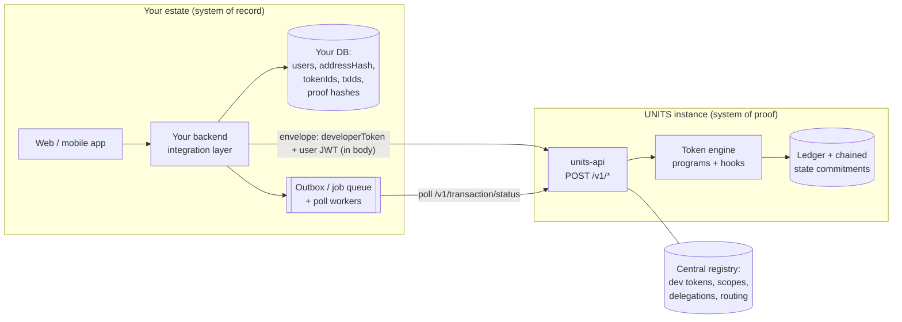
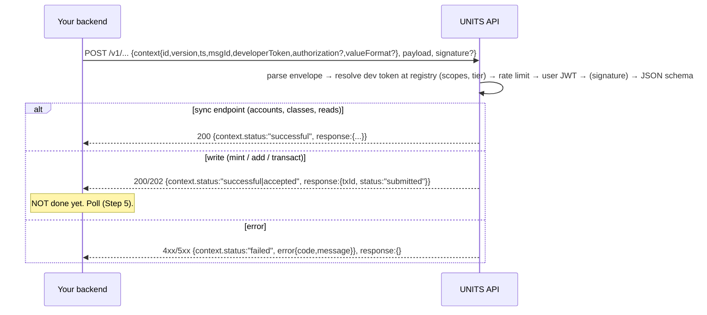
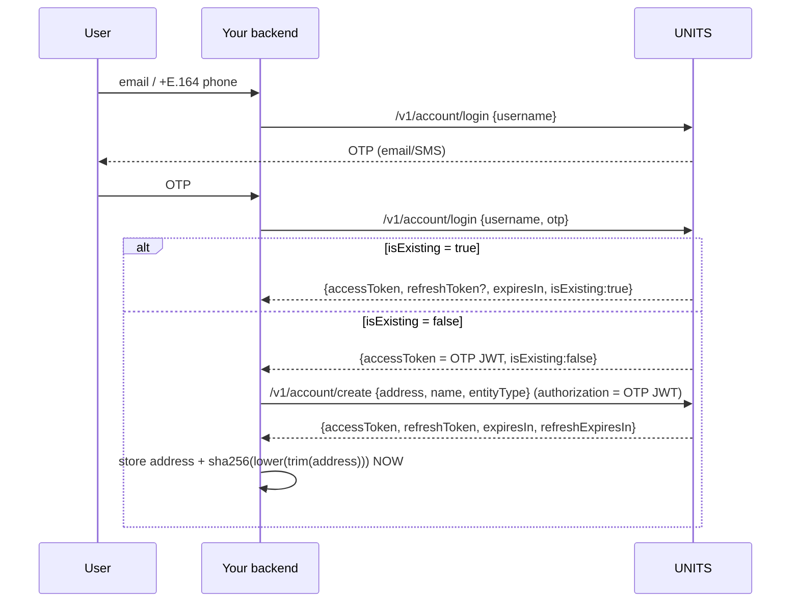
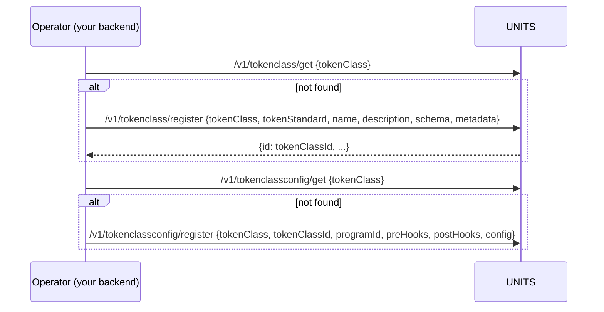
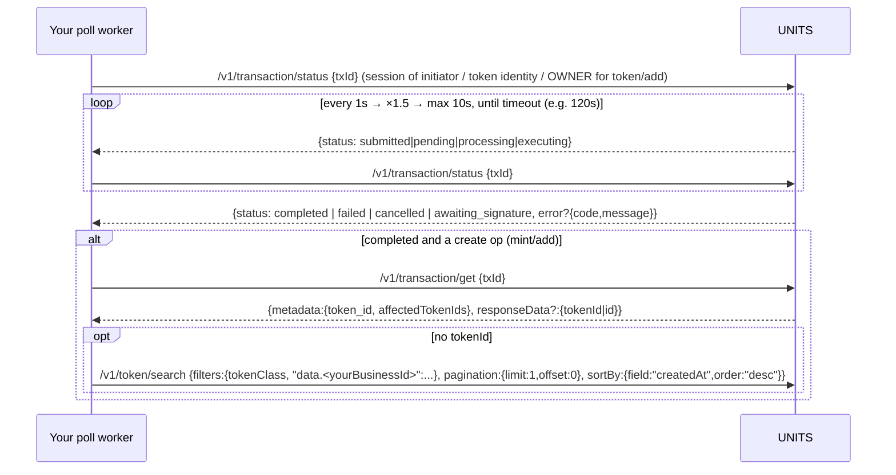

# UNITS integration playbook (for external integrators)

This is a step-by-step guide for fintechs, lenders, registries and voucher platforms that integrate with **UNITS** (Unified Information Tokenisation System), Finternet's federated ledger and token platform.

- **Snapshot:** 2026-10-03.
- **Sources:** live behaviour verified on the sanctum sandbox (Aug 2026), plus units-api and token-runtime code as of Sep/Oct 2026.
- **Precedence when sources disagree:** live behaviour first, then code, then specs, then the public docs. Where live behaviour and code differ, this guide says **environment-dependent** and shows both.
- **Always check your own instance:** `/v1/tokenclassconfig/get`, `/v1/tokenprogram/search`.

Related files:
- [token-classes.md](token-classes.md): how to design token classes and pick programs.
- [worked-examples.md](worked-examples.md): end-to-end scenarios with the full JSON.
- `../examples/`: runnable clients (`units-client.ts`, `units_client.py`), `quickstart.sh`, and ready class payloads.

---

## Contents
- Step 0. Prerequisites, what to ask Finternet for, architecture
- Step 1. Envelope client
- Step 2. Users: OTP login and signup, storing the address hash
- Step 3. Design and register token classes and configs
- Step 4. Writes: mint, add, transact
- Step 5. Polling and resolving the tokenId
- Step 6. Reads, ledger and proofs
- Step 7. Delegations (consent)
- Step 8. Production hardening: sessions, retries, idempotency, rate limits, logging, error matrix, sagas R1–R6, timeouts
- Go-live checklist
- What UNITS does not do yet, and how to design around it

---

## Step 0. Prerequisites

### 0.1 Environments

| Env | Web app | UNITS API base | Notes |
|---|---|---|---|
| Sandbox / staging ("Sanctum") | sanctum.finternetlab.io | `https://units.sanctum.finternetlab.io` | The integrator sandbox. Fixed OTP `123456`. Available roughly 08:00–21:00 IST on weekdays. |
| Production | my.finternetlab.io | `https://units.finternetlab.io` | Real OTPs. Production may run an older build than sandbox; re-test environment-dependent behaviour. |
| Dev ("Foundry") | foundry.finternetlab.io | `https://units.foundry.finternetlab.io` | Internal development; may be unavailable to integrators. |

Do not invent other hostnames. The public docs say base URLs are "to be disclosed".

### 0.2 What to ask Finternet for

**Out of scope for this skill:** commercial and regulatory onboarding, such as KYB of your organisation, contracts, pricing, SLAs, data-processing agreements and which instance or tenant you are placed on. Contact Finternet for those. What follows is the technical access you need.

**Get your developer token yourself** in the web portal: log in at https://sanctum.finternetlab.io (sandbox) or https://my.finternetlab.io (production) → **API Access → Register client**, pick scopes, and copy the developer token (shown once). The full walkthrough is in [portals-and-access.md](portals-and-access.md). Calling `/v1/clients/register` directly requires a superadmin ("interim governance"), so if the portal path isn't available, email engineering@finternetlab.io and ask for the following:

1. **A developer token** for each environment. It is `base64("sa-<client-uuid>:<clientSecret>")`, is returned in plaintext only once, and goes in `context.developerToken` on every call. Ask the platform team to:
   - name your **operator account** (see 0.3) as the client owner;
   - tell you how to rotate it: `/v1/clients/rotate-secret {clientId, graceSeconds}` keeps the old secret valid for a grace period.
2. **The scopes** you need, in the format `entity:action`. Request the minimum:

   | You call | Scope |
   |---|---|
   | login, refresh, create account, account/get | `accounts:create`, `accounts:view`, `accounts:manage` |
   | key register/search | `keys:create`, `keys:view` |
   | tokenclass register/get/update | `tokenClasses:create`, `tokenClasses:view`, `tokenClasses:manage` |
   | tokenclassconfig register/get/update | `tokenClassConfigs:create`, `tokenClassConfigs:view`, `tokenClassConfigs:manage` |
   | token/mint, token/add | `tokens:create` |
   | token/transact (every operation, including `update`) | `tokens:transact` (one scope per API id; `tokens:manage` is not checked) |
   | token/get, search, transactions, transaction/*, proofs | `tokens:view` |
   | delegations list/check, workflows/execute (delegation-create/revoke) | `delegations:view`, `workflows:create`, `workflows:view` |
   | tokenprogram/search (discovery) | `registry-programs:view` |

   The mapping from API id to scope lives in the central registry. A scope missing from your client gives `403 CLIENT_INSUFFICIENT_SCOPE`. An API id that has no mapping at all gives `500 SCOPE_MAPPING_NOT_CONFIGURED`. **Ask the platform team to confirm that every API id you plan to call is mapped.** You can also ask for `allowedOperations` restrictions, for example `{"tokens:transact": {"payload.operation": ["loan_disbursed","payment_received"]}}`, to limit the blast radius.
3. **A rate-limit tier** and your expected throughput.
4. **The live program list and token standards** on your target instance, and which environment-dependent checks (e.g. transact signature enforcement) are on. Always build signing in regardless.
5. **For production:** a non-OTP way to keep your operator account logged in. Today a human must enter an OTP when the session cannot be refreshed. Also ask for the refresh-token behaviour of that build.

### 0.3 Architecture pattern

**Your system is the system of record. UNITS is the system of proof.**

- Your database keeps people, relationships, business IDs, PII and workflow state.
- UNITS holds tokenised state with a hash-chained, tamper-evident history.
- You store back in your database: token IDs, txIds, the state commitment ("proof hash") for each state change, and status flags such as lien state.



Rules:
- **Server-side only.** The developer token must never reach a browser or app bundle. End users never call UNITS directly from your frontend.
- **Use one operator account.** This is a real UNITS user account (entityType `BUSINESS`) that your organisation owns.
  - It registers all your token classes. Whoever registers a class owns it, and only issuers of a class can mint it.
  - It performs all platform-level writes: loan ops, minting your fungible tokens, and so on.
  - Back up its signing key (Step 4.4) and its session handling (Step 8.1).
- **End users get their own accounts** through OTP signup. They own their credentials and assets and can grant consent (delegations).
- **No webhooks.** Your integration layer owns the poll loops (Step 5).
- **Federation:** every account has one home instance. Logging in against the wrong instance returns `409 FORWARD`, with the home instance named in the message.

---

## Step 1. Envelope client

Every business endpoint is `POST /v1/...` with `Content-Type: application/json`. The body looks like this:

```json
{
  "context": {
    "id": "api.token.mint",
    "version": "1.0",
    "ts": "2026-10-03T10:00:00Z",
    "msgId": "6f1c2a8e-3b7d-4e0a-9a51-0c3f2d9b7e11",
    "developerToken": "<DEV_TOKEN>",
    "authorization": "Bearer <USER_JWT>",
    "valueFormat": "raw"
  },
  "payload": { },
  "signature": { "keyId": "<key id>", "jws": "<base64 Ed25519 over JCS(payload)>" }
}
```

| Field | Rule |
|---|---|
| `context` | `additionalProperties:false`. **Any unknown key returns 400 INVALID_INPUT.** Allowed keys: `id, version, ts, msgId, developerToken, authorization, valueFormat, transactionId, debug` (and `developerSignature`, which is accepted but ignored). |
| `id` | API id such as `api.token.mint`. It is echoed back; the server assigns the real id from the route. |
| `version` | `"1.0"` per the spec. `"v1"` is also accepted live. |
| `ts` | RFC 3339 UTC. |
| `msgId` | A **fresh UUID on every attempt, retries included.** |
| `developerToken` | On every call. |
| `authorization` | `"Bearer <jwt>"`: the user session, or the OTP JWT for `account/create` only. Omit it for login and for sessionless `token/add`. |
| `valueFormat` | `raw` means base-unit integer strings; `display` means decimals scaled by class `metadata.decimals`. **Send it only on `token/get`, `token/search`, `token/mint` and `token/transact`, and always send it explicitly there**, because the code default is `display` while the schema text says `raw`. On every other endpoint, including `token/add`, the closed context schema rejects it with 400. |
| `signature` | Required on `/v1/token/transact` when the instance enforces signatures (environment-dependent; always send it). Optional elsewhere. |

Response shape:

```json
{ "context": { "id": "...", "ts": "...", "msgId": "<echo>", "status": "successful", "transactionId": "0199..." },
  "response": { } }
```

- `context.status` is one of `successful`, `accepted` or `failed`.
- **Data is in `response`, not `payload`.**
- An error looks like `{"context":{..., "status":"failed","error":{"code":"INVALID_INPUT","message":"..."}},"response":{}}`. Only `code` and `message` reach you.
- **ok = HTTP 2xx AND `context.status != "failed"`.**

Headers:
- The only optional header UNITS reads is `X-Correlation-ID`. It is echoed back; use your business ID.
- **No `Authorization` header is read.** Older docs and OpenAPI that say `Authorization: Bearer <devToken>` or `X-Finternet-Signature` are stale.
- GET endpoints, apart from `/v1/health` and `/.well-known/*`, are unusable under service-account auth.
- `GET /v1/did/:address` is disabled. Use `POST /v1/address/resolve` instead.

Copy `examples/units-client.ts` or `examples/units_client.py`. Each implements this envelope, ok-checking, error extraction, retries for retry-safe calls, timeouts and logging hooks.



---

## Step 2. Users: OTP login and signup, storing the address hash



1. **Send the OTP.** Call `/v1/account/login` with payload `{"username":"farmer@example.com"}`, with no authorization. The username is an email or an E.164 phone number. It may send a real email or SMS even on the sandbox.
2. **Verify it.** Call `/v1/account/login` with `{"username":"farmer@example.com","otp":"123456"}`. The sandbox accepts `123456`; production needs the real OTP.
   - The response is `{accessToken, tokenType, expiresIn, refreshToken?, refreshExpiresIn?, isExisting}`.
   - If `isExisting:false`, the `accessToken` is an **OTP JWT that is only usable for `/v1/account/create`.**
3. **Create the account.** Call `/v1/account/create` with `authorization: "Bearer <OTP JWT>"`:
   ```json
   {"address":"farmer-7c1e2a.acme","name":"Ramasamy Pillai","entityType":"PERSONAL"}
   ```
   - `address` must match `^[a-z0-9._-]+$`, be lower case and be at most 255 characters.
   - `name` may contain letters and spaces only.
   - **`entityType` is `PERSONAL` or `BUSINESS`.** `Individual` is stale.
   - Email and phone come from the OTP JWT, never from the payload.
   - The response contains real session tokens. Replace the OTP JWT with them.
4. **Store the identity immediately.** The identity UNITS authorises against is:
   ```
   addressHash = hex(sha256(lower(trim(address))))   // no 0x; == JWT preferred_username
   ```
   - **It is not the DID.** `did:units:0x<ed25519 pubkey>` is unrelated.
   - `/v1/account/get` returns the address **masked** (for example `"f***ed"`), and **no endpoint reveals the hash of an existing account.** Record the plaintext address and its hash at signup. That is your only chance.
   - Sanity check: decode the new JWT and assert `preferred_username == addressHash`.
5. **Plaintext address versus hash.** This is the biggest integration trap.

   | Use the PLAINTEXT address in | Use the HASH in |
   |---|---|
   | `transact.to` (transfer and voucher issue recipient), delegation `grantee_address`, class `identities[].id`, `/clients/register identities[].address`, `/address/*` | `/v1/token/add` `owner` (sessionless issuance), the `credentialSubject.id` convention, comparing against `preferred_username` |

6. **Existing accounts** (`isExisting:true`): you get the hash from `preferred_username` in their JWT, but you cannot get the plaintext address back. Ask the user for it, or store it whenever you first learn it.

---

## Step 3. Design and register token classes and configs

See [token-classes.md](token-classes.md) for design guidance. In summary:

- **Token class**: what a token *is*. It has a key (`tokenClass`, upper-cased by the server and **globally unique across tenants**, so prefix it with your org), `tokenStandard`, `name`, `schema` (JSON Schema used **for documentation only and not enforced**), `identities` (who may mint) and `metadata` (decimals, symbol, flags, contractIds and so on).
- **Token class config**: binds the class to a **token program** and sets hooks and engine config. **Without it every operation fails with `INVALID_INPUT: primitive_capability_missing`.** Each class has exactly one config.
- **Token program**: Rust logic inside the engine. You **choose** one; you cannot deploy one. A custom program is Finternet engineering work, measured in days per program.

| Need | programId | tokenStandard (exact) | Create with |
|---|---|---|---|
| Points, deposits, generic balances | `fungible` | `UNITS-FT` (also `ERC-20`, `ERC-3643`) | `/token/mint` |
| Unique asset | `non-fungible` | `UNITS-NFT` (`ERC-721`) | `/token/mint` (environment-dependent) |
| Soulbound credential (W3C VC) | `credential` | `UNITS-CREDENTIAL` (`UNITS-SBT`, `W3C-VC-2.0`) | `/token/add` |
| Proxy of an on-chain stablecoin or asset | `stables` | `PROXY-FT` | `/token/add` (chain fields) |
| Loan lifecycle | `loan-nft-program` | `UNITS-Loan` | `/token/mint` (= `loan_originated`) + domain ops |
| Securitisation pool | `loan-pool-nft-program` | `UNITS-LoanPool` | `/token/mint` (snake_case data) |
| Purpose-bound voucher | `purpose-bound-voucher` | `UNITS-SFT` | **blocked**: `CAPABILITY_DENIED` |

A `tokenStandard` that is not on the program's whitelist fails **asynchronously** with `UNSUPPORTED_TOKEN_STANDARD`, which you only see when polling.

Registration is idempotent if you get first and register only when missing. Both calls are **synchronous** (no polling) and are made with the **operator session**:



```json
// /v1/tokenclass/register  (context.id "api.tokenclass.register", authorization = operator JWT)
{"tokenClass":"ACME-PTS","tokenStandard":"UNITS-FT","name":"ACME Loyalty Points",
 "description":"Fungible loyalty points","schema":{"type":"object"},
 "metadata":{"decimals":2,"symbol":"ACMEPTS","fungible":true,"category":"utility","transferable":true,
             "divisible":true,"burnable":true,"revocable":false,"soulbound":false,"maxSupply":"100000000000"}}
// response: {"id":"01a0...","tokenClass":"ACME-PTS",...}

// /v1/tokenclassconfig/register
{"tokenClass":"ACME-PTS","tokenClassId":"01a0...","programId":"fungible",
 "preHooks":[{"hookId":"max-supply","priority":5,"enabled":true,"operations":["mint"]},
             {"hookId":"validation","priority":10,"enabled":true},
             {"hookId":"logging","priority":20,"enabled":true}],
 "postHooks":[{"hookId":"logging","priority":1,"enabled":true}],
 "config":{"stateCommitmentAlgorithm":"sha256"}}
```

Ready-made payloads for every example class are in `examples/token-classes/*.json`, and the clients' `ensureTokenClass` / `ensure_token_class` consume them.

Class `identities` controls who may mint:
- **Omitted:** the registering caller is stamped as owner and issuer. Do this.
- **`[]`:** on register, this is treated like omitted: the caller is stamped as owner and issuer. A class only becomes open to any minter if its *stored* identities are `[]`, which happens with seeded proxy, NFH-T or SODEXO-MV classes, or via `/tokenclass/update`.
- **A list of `{id:<plaintext address>, type:"issuer"}`:** multiple minters. If you do this, also include yourself.

Seeded classes such as `LOAN-NFT`, `CREDENTIAL` and `NFH-T` are owned by Finternet seed accounts, so register your own.

**Freeze class names and schemas on day one.** Updates happen in place and have no version column.

---

## Step 4. Writes: mint, add, transact (all asynchronous)

The sync response is only `{txId, status:"submitted", ...}`. **Never tell a user an action succeeded at this point.** Go to Step 5.

### 4.1 Mint: `/v1/token/mint` (user JWT; the caller must be an issuer of the class)

```json
{"tokenClass":"ACME-PTS","initialSupply":"100000",
 "metadata":{"name":"ACME points pool","tags":{"campaign":"diwali-2026"}},
 "data":{"programRef":"PTS-2026-001"}}
```

- `initialSupply` is a string: `"1"` for an NFT, loan or pool; base units for fungible tokens when `valueFormat:"raw"`.
- **Never send `identities[]`.** This was verified live: supplied ids are re-hashed, the caller loses their rights, and the next transact fails with `FORBIDDEN no_matching_allow_rule`. The engine stamps issuer, creator and owner from the caller. Put relationship data such as `borrowerId` or `beneficiaryRef` in `data`.
- Also allowed: `claims`, and `extensions{<programId>:{...}}`, which must be namespaced to the class's own program id.
- **The response contains no tokenId.** See Step 5.

### 4.2 Add: `/v1/token/add`

- **Credential, sessionless** (developer token only; no authorization):
  ```json
  {"tokenClass":"ACME-KYC","owner":"<sha256 address hash of the holder>",
   "credential":{"@context":["https://www.w3.org/ns/credentials/v2"],"type":["VerifiableCredential","KYCCredential"],
     "issuer":"did:units:acme-kyc","validFrom":"2026-10-03T00:00:00Z","validUntil":"2027-10-03T00:00:00Z",
     "credentialSubject":{"id":"<same hash>","documentType":"PAN","country":"IN","faceMatchVerified":true,"faceMatchPercentage":"97"},
     "evidence":[{"type":["KycEvidence"],"rawPayload":{"anything":"your domain data"}}]},
   "metadata":{"name":"KYC — Ramasamy","tokenStandard":"UNITS-CREDENTIAL"}}
  ```
  - `credentialSubject` is a **closed, KYC-shaped** schema. Required fields: `id`, `documentType`, `country`, `faceMatchVerified` (bool) and `faceMatchPercentage` (string). Optional: givenName, familyName, documentNumber, documentExpired, dateOfBirth, address, gender.
  - **Put domain data in `evidence[].rawPayload`.**
  - A wrong `owner` value gives `RESOURCE_NOT_FOUND "Owner address not found"`.
  - Poll the resulting tx **with the owner's session.**
  - The credential's identities belong to the holder; your operator gets no identity, so revoking needs the holder's session or a `transact` delegation. Tell verifiers to validate credential provenance (expected token class, VC `issuer`, provider signature/evidence, and confirmation from your service) rather than relying on class membership alone (`token-programs.md` §6.3).
- **Proxy:** see worked example E.
  ```json
  {"tokenClass":"USDC","chainId":"eip155:8453","contractAddress":"0x833589fCD6eDb6E08f4c7C32D4f71b54bdA02913","walletAddress":"0x<user wallet>","value":"25000000"}
  ```

### 4.3 Transact: `/v1/token/transact` (user JWT + signature; 202)

Every operation after creation goes through `operation`. There are no separate `/burn` or `/transfer` endpoints.

```json
{"operation":"burn","tokenId":"<uuid>","value":"2500","reason":"redeemed ORDER-8841"}
```

| Kind | Payload fields |
|---|---|
| Generic (`transfer, burn, freeze, unfreeze, lock, unlock, update`) | top-level `value` (**not `amount`**), `to` (plaintext recipient), `toAddress` (proxy wallet), `category` (voucher), `reason`, `frozenBy`, `lockedBy`, `lockUntil`, `metadata` (`update`) |
| Domain (loan ops, credential `revoke`/`suspend`/`resume`, pool ops) | the operation's own fields **inside `data`** |

Loan-program amounts: **current code uses `data.value`** (refactor #220, "amount→value"). Older builds accepted `data.amount`. This is **environment-dependent**: send `value`, and fall back to `amount` if the instance answers with a missing or unknown field error.

Number rules:
- Amounts are strings.
- Loan u128 fields are **integer strings** with no decimal point (`"12.29"` fails asynchronously with `invalid digit found in string`).
- u32 fields (tenure, emiDay, tranche, counts) are JSON numbers.
- `foir` is an integer string from 1 to 10000, in basis points (`"4500"` = 45%). `"1"` is valid everywhere (live-verified). The error text "foir must be in (0, 1]" is misleading; `"0"` fails.
- Loan keys are camelCase; loan-pool keys are snake_case.

Resource permission (OPA, on the token's identities and delegations, separate from client scopes): `update` needs **manage**; every other operation needs **transact**. The owner/issuer has both. The client scope for all of them is just `tokens:transact`.

### 4.4 Envelope signature (transact)

`signature = {keyId, jws}`:
- `jws` is the **standard base64 of a raw Ed25519 signature** over the **RFC 8785 (JCS)** canonical bytes of `payload`. It is not a compact JWS.
- `keyId` is the `id` of an **active ed25519 key belonging to the session account**.

Setup, once per account that transacts (usually your operator):
1. Generate an Ed25519 key pair and keep the seed in your KMS or secret manager.
2. Call `/v1/account/keys/register {"publicKey":"<64 hex>","type":"ed25519","name":"envelope-signing"}` with that account's session.
3. Store the returned `id` as the `keyId`.

Behaviour:
- Missing signature: `401 "signature with keyId and jws is required"`. A key from another account: `401 "...does not belong to the authenticated account"`.
- Signature enforcement on transact is **environment-dependent, so always build signing in and always sign.**
- Both example clients implement JCS and signing and produce byte-identical output.
- Users who transact their own tokens (for example a proxy transfer) need their own registered ed25519 key. An EVM `secp256k1` wallet key does not work for envelope signatures.

---

## Step 5. Polling and resolving the tokenId

There are no webhooks, SSE or websockets. You own the poll loop.



- **Terminal statuses:** `completed`, `failed`, `cancelled`. **Needs action:** `awaiting_signature`, used in proxy flows that need a user-signed chain tx (see `transaction/get.responseData.unsignedTx`). **In flight:** `submitted`, `pending`, `processing`, `executing`.
- **Most validation errors only appear here:** wrong tokenStandard, bad u128 strings, unknown identity type, FORBIDDEN, missing fields. They are in `response.error {code, message}`.
- **Who can poll:** the initiator, or an identity on the token. **For a sessionless `token/add`, poll with the OWNER's session.** The operator gets `FORBIDDEN "not authorized to access this transaction"`.
  - A service-account-only alternative is `/v1/transactions/status {"txn_id":"<txId>"}`. Note the snake_case key. It returns the federation lifecycle `SUBMITTED|PREPARED|COMMITTING|COMMITTED|ABORTED|AUTO_REVERSING|REVERSED|STUCK`. Confirm its scope mapping on your instance.
- **Resolving the tokenId:**
  1. Call `transaction/get`. Read `response.metadata.token_id` (stamped by units-api when a create op completes), then `metadata.affectedTokenIds[0]` (written by the engine), then the legacy `responseData.tokenId` / `.id` (current code only fills `responseData` for proxy flows). See `api-reference.md` §5.5.2.
  2. As a fallback, search for the newest token of the class, **narrowed by your business ID** in `data` to avoid picking up a concurrent mint.
- **Timeouts:** the response's `estimatedCompletionTime` is cosmetic (now + 30 s). On timeout, record the tx as `unknown`, keep polling in the background, alert, and **do not resubmit** until you have proved the first attempt failed.
- On `completed`, store the txId, the tokenId and the commitment from `token/get` (or the `transaction/proof` `stateCommitment`) against your business record.

---

## Step 6. Reads, ledger and proofs

| Call | Payload | Notes |
|---|---|---|
| `/v1/token/get` | `{tokenId}` | Returns 403 unless the caller is an identity on the token or holds a matching delegation. Response: `{id, tokenClass, tokenClassInfo, metadata, data, claims, identities, state{...}}`. |
| `/v1/token/search` | `{filters, groupBy?, aggregateFields?, pagination{limit≤1000, offset}, sortBy}` | **Always scoped to tokens where the caller is an identity.** Filters accept columns and dot-paths (`data.loanRefId`, `metadata.tags.x`, `state.status`). |
| `/v1/token/transactions` | `{filters:{tokenId, operation?, entryType?, dateRange?{from,to}}, pagination, sortBy}` | Per-token ledger history with before/after state. |
| `/v1/transaction/get` | `{txId}` | `status`, `error`, `metadata` (`token_id`, `affectedTokenIds`), `responseData` (proxy flows), `timestamps`, `identities`. |
| `/v1/transaction/search` | `{filters, pagination, sortBy}` | Includes failed attempts. Was not observed to be ownership-scoped. |
| `/v1/transaction/proof` | `{txId}` | `stateCommitment`, `leafHash`, `merkleRoot`, `proofPath`, `proofStatus: pending\|proven\|anchored`, `ledgerAnchors`. |
| `/v1/transaction/proof/leaf` | `{txId}` | The leaf pre-image. |
| `/v1/transaction/proof/verify` | `{txId}` | **Structural check only.** |

**What you can honestly claim:**
- Every write computes a **chained state commitment** (SHA-256 by default, BLAKE3 optional): `commitment[n] = H(commitment[n-1] ‖ tx ‖ timestamp ‖ state…)`. The engine refuses to operate on a token whose chain fails verification. This is live. Say "hash-chained and tamper-evident".
- Merkle batch proofs are generated only when a batch fills, so they usually read `pending`. **Chain anchoring is not implemented.** Do not say "anchored on blockchain" or "independently verified".
- Token data is **not** encrypted at rest. Do not put raw PII in `data` or `evidence`: hash or mask it, and keep the PII in your own system.

---

## Step 7. Delegations (consent)

Resource access is decided by three things:
- **Owner identity:** the owner can do everything.
- **Any identity on a token:** can view it.
- **Delegations:** granted by labels.

**Labels:**
- `tokens:id:<uuid>`
- `tokens:tokenclass:<CLASS>`
- `tokens:*`
- `tokens:tokenclass.metadata.status:active`

**Permissions:** `view`, `transact` or `manage`. These are flat: manage does **not** imply transact or view.

```json
// grant: executed with the GRANTOR's (token owner's) session
POST /v1/workflows/execute
{"workflow":"delegation-create","action":"allow",
 "data":{"grantee_address":"acme-lender-ops","label":"tokens:id:01a0c3...","permission":"view","expires_at":"2026-12-31T23:59:59Z"}}
// -> 202 {"delegation_id":"<uuid>","status":"pending"}   (moves to active within seconds for an owner grant)

// other actions: "deny" (shadows allows for the same label+permission), "approve"/"reject"/"cancel" {"delegation_id"}
// revoke
{"workflow":"delegation-revoke","action":"revoke","data":{"delegation_id":"<uuid>"}}

// inspect
POST /v1/delegations/list  {"filter":"granted_by_me"}   // or granted_to_me | pending
POST /v1/delegations/check {"tokenId":"01a0c3..."}      // -> permissions{view|transact|manage:{allowed,source,...}}
```

- `grantee_address` is the grantee's **plaintext** address.
- A grant by the owner activates automatically. When a non-owner requests access, the request goes to `pending` until the owner `approve`s it.
- The grantor must be an identity on the token.
- Activation is asynchronous through workflows. After granting, poll `delegations/check` or `list` before you depend on it.

**Consent patterns:**
- A borrower grants a lender `view` on their credential (worked example C).
- An originator grants a servicer `transact` on its loan class (worked example B).
- An optional deny-list removes a specific operation.

**Not enforced today:** amount, frequency, geo or device limits on delegations.

---

## Step 8. Production hardening

### 8.1 Sessions and refresh tokens
- Observed Keycloak settings: the access token lives about **10 h** (`expiresIn: 36000`), the **refresh idle timeout is 30 min**, and **refresh tokens are single-use**. Presenting the same refresh token twice kills the session with `401 SESSION_REVOKED`.
- Refresh **on a timer well under 30 min** (for example every 20 min) with `/v1/account/refresh {"refreshToken"}`, using a **single-flight lock**. Always persist the new refresh token. If several workers share one operator session, keep the tokens in a shared store with a distributed lock.
- Some builds return no `refreshToken`. In that case, re-login before `expiresIn`. On prod that means a real OTP, so ask Finternet for a non-OTP operator path (Step 0.2).
- `SessionManager` in both example clients implements all of this.
- `/v1/account/logout` kills **all** sessions of that user.

### 8.2 Retries and idempotency
- **There is no idempotency key.** A blindly retried mint or transact can be executed twice.
- Use a **fresh `msgId` on every attempt.** It is a message id, not an idempotency key.
- **Dedupe on your own business IDs:**
  - Carry `loanRefId`, `orderReference`, `depositId` and similar in `data`.
  - Before you resubmit a write whose outcome is unknown, search for it: `token/search {filters:{tokenClass, "data.loanRefId":"LN-1"}}`, or `token/transactions` for an operation.
- Treat a duplicate credential as success: `409`, or "Credential already exists — cannot add duplicate".
- Retry automatically only on **reads** and polls, and only on `429`, `502`, `503`, `504` or network errors. Use exponential backoff with jitter.
- Retry writes only after you have reconciled their state.

### 8.3 Rate limits
- Limits are per service-account tier × scope. You get `429 TOO_MANY_REQUESTS` with a **`Retry-After`** header; honour it.
- An OTP rate limit returns `429` with code `EXTERNAL_SERVICE_ERROR`.
- Spread poll loops out: back off, and keep concurrency per txId at one.

### 8.4 Logging and observability
- Log `path`, `context.id`, `msgId`, `X-Correlation-ID`, HTTP status, `context.status`, `error.code`, `error.message`, txId and duration.
- **Never log `developerToken`, JWTs, refresh tokens or OTPs.**
- Keep full request/response bodies, with secrets redacted, for failed calls. Most bugs only make sense next to the async error.
- `context.debug:true` makes the server record the request as trace attributes. Use it in the sandbox only.

### 8.5 Error-handling matrix

| Signal | Typical cause | Action |
|---|---|---|
| `400 INVALID_INPUT` (sync) | Schema violation: unknown `context` key, `amount` instead of `value`, `entityType:"Individual"`, a name with digits | Fix the payload. Never retry. |
| `400 INVALID_INPUT primitive_capability_missing` | Class has no tokenclassconfig | Register the config. |
| `400 operation_not_supported` | Program doesn't list the operation | Check `/v1/tokenprogram/search`. |
| `400 federation transfer is not supported...` | Transfer on a CREDENTIAL, Loan or LoanPool token | By design: these are not transferable. |
| `401 UNAUTHORIZED` (dev token) | Bad, rotated or deactivated developer token | Fix the credential and alert. |
| `401 UNAUTHORIZED` (JWT) | Expired session | Refresh, then retry once. |
| `401 SESSION_REVOKED` | Refresh token reused | Re-login, and fix your single-flight lock. |
| `401 signature...` | Missing, foreign or inactive key | Register the key or fix keyId and JCS. |
| `403 CLIENT_INSUFFICIENT_SCOPE` | Service account lacks the scope | Ask Finternet. |
| `403 FORBIDDEN no_matching_allow_rule` / "not authorized to mint tokens for this class" | Wrong account (not class owner, issuer or token identity), or `identities[]` was sent on mint | Use the operator or owner session. Never send identities. |
| `403 FORBIDDEN not authorized to access this transaction` | Polling a `token/add` as the operator | Poll with the owner's session. |
| `404 RESOURCE_NOT_FOUND Owner address not found` | `token/add owner` is not the hash, or the account doesn't exist | Use `sha256(lower(trim(address)))`. |
| `404 recipient_address_not_found` | Transfer recipient not resolvable (open issue on sanctum) | Design around it (see below). |
| `409 CONFLICT` | Class or program already exists, duplicate sessionless proxy import, sender homed elsewhere | Get the existing one. Check ownership. |
| `409 FORWARD` | Account is homed on another instance | Call the instance named in the message. |
| `429` | Rate limit | Wait for `Retry-After`, then retry reads. Throttle writes. |
| `500 SCOPE_MAPPING_NOT_CONFIGURED` | API id unmapped in the registry | Ask Finternet. Not retryable. |
| `503 EXTERNAL_SERVICE_ERROR` / `AUTHZ_LOOKUP_FAILED` | Registry, Keycloak, Vault, Kafka or OTP down | Back off and retry reads. Queue writes. |
| Poll `failed` + `UNSUPPORTED_TOKEN_STANDARD` | tokenStandard not on the program's whitelist | Fix the class. |
| Poll `failed` + `INVALID_PAYLOAD unknown variant` | Bad identity type or enum value (types: issuer, creator, owner, co-owner, operator, viewer, access) | Fix the payload. |
| Poll `failed` + `invalid digit found in string` | Decimal in a u128 field | Send integer strings. |
| Poll `failed` + `CAPABILITY_DENIED` | purpose-bound-voucher, or a program lacking DomainLifecycle | Not supported. Design around it. |
| Poll stuck in-flight past the timeout | Engine backlog, or a STUCK saga | Alert. Check `/v1/transactions/status`. Don't resubmit. |
| `transaction/proof` `pending` | Batch not full | Expected. Proceed and re-read later. |

### 8.6 Sagas and ordering (R1–R6)

UNITS has no multi-call transactions you can use. Order dependent writes yourself. **Only submit the next write after the previous one has reached `completed`**, and define compensations.

| # | Rule | Why |
|---|---|---|
| R1 | The credential or source fact (`token/add`) completes **before** anything references its tokenId (an asset mint, or a loan mint carrying `credentialTokenId`) | The cross-link must point at a real token. |
| R2 | All creation writes reach `completed`, and you have fetched tokenIds and commitments, **before** your system of record marks the record "tokenised" | Your DB stores the IDs and proof hashes. |
| R3 | The lien or encumbrance (`cersai_registered`, or a lock) completes **before** money moves (voucher issue or disbursement). If the next step fails, compensate (release or unlock). | Collateral is encumbered before value leaves. |
| R4 | Voucher or benefit activation is recorded **before** `loan_disbursed` | The disbursement record mirrors activation. |
| R5 | `loan_closed` **before** lien release; only then is the asset free | Collateral is released only after the debt is extinguished. |
| R6 | Use a fresh `msgId` per attempt, and dedupe on business keys (`loanRefId`, `orderReference`, `(partnerId, farmerId, cattleId)`, `depositId`) | There is no platform idempotency. |

Implement sagas as durable jobs: an outbox row, then submit, then poll, then advance state. The loop must survive restarts, because a process crash between submit and poll must not lose the txId.

### 8.7 Timeouts (suggested)

| Call | Timeout |
|---|---|
| HTTP request | 30 s |
| Poll loop | 120 s interactive, then hand off to a background worker (alert at 10 min) |
| OTP entry | Your UX (OTPs expire server-side) |
| Delegation activation | Poll `delegations/check` for up to 60 s |

---

## Go-live checklist

- [ ] You have a production developer token in a secret manager. It is rotatable through `/v1/clients/rotate-secret` with a grace period, and has never been in git, the frontend or logs.
- [ ] Finternet has confirmed that every API id you call is scope-mapped for your client. Rate tier agreed.
- [ ] The operator account exists on prod. Its envelope signing key is registered and its seed is in KMS. Its session is kept alive by a refresh timer, or a non-OTP path is agreed.
- [ ] Classes registered on **prod** under your org prefix. Configs bound. `tokenclassconfig/get` shows the right `programId`. `tokenprogram/search` lists every operation you use.
- [ ] Every class's `tokenStandard` is on its program's whitelist. Tested end to end on sanctum, including the polled outcome.
- [ ] The signup path stores the plaintext address and its hash. The `preferred_username == hash` assertion is in place.
- [ ] No `identities[]` on mint. `valueFormat` is set explicitly on token get/search/mint/transact, and nowhere else. Amounts are strings. Loan amount field (`value` or `amount`) verified against the prod build.
- [ ] Every write goes through the outbox, then submit, then poll, then resolve. No UI shows success on a 202. Poll timeouts alert.
- [ ] Dedupe by business ID before any resubmission. Duplicate-credential errors are treated as success.
- [ ] Saga ordering R1–R6 is implemented with compensations.
- [ ] `429 Retry-After` is honoured, with backoff and jitter. Only reads are auto-retried.
- [ ] Logs redact secrets. Correlation IDs are set to business IDs.
- [ ] No raw PII in token `data` or `evidence`. Retention obligations (DPDPA, PMLA/RBI KYC) are handled in your system.
- [ ] Customer-facing proof claims say "hash-chained, tamper-evident", not "anchored on blockchain" or "independently verified".
- [ ] Known gaps that apply to you (below) have documented workarounds and owners.

---

## What UNITS does NOT do yet, and how to design around it

| Gap (as of 2026-10) | Design-around |
|---|---|
| No webhooks, SSE or event egress | Run your own poll workers (Step 5). For dashboards, poll `token/transactions` with a `dateRange`. |
| Mint and add don't return a tokenId | Use `transaction/get` → `metadata.token_id` / `metadata.affectedTokenIds`, or a search narrowed by business ID. |
| No idempotency key | Dedupe by business ID, use an outbox, and never auto-retry writes. |
| Class `schema` not enforced | Validate `data` in your backend before every write. Programs validate only their own structs. |
| `operationOverrides` stored but not enforced | Enforce allowed operations in your backend, and ask Finternet for `allowedOperations` on your client. |
| `purpose-bound-voucher` cannot be minted (`CAPABILITY_DENIED`) | Use a `fungible` voucher token owned by the operator, enforce category caps in your app, and record redemptions as `burn` with a reason, or as `update` of the data (worked example F). |
| Fungible transfer to other users failed on sanctum (`recipient_address_not_found`) | Keep per-user balances as operator-owned tokens tagged with the user's hash in `data`, or off-ledger. Test transfer on your instance after registering the recipient's keys. |
| No generic lien or asset program; `non-fungible` availability depends on the environment | Record liens as `cersai_registered` on the loan token, or `lock`/`unlock` an NFT. Request a custom program (days of Finternet work). |
| credential-verification hook is a presence check that compares the VC `type` as a string | Do eligibility checks in your backend before calling. Don't rely on the hook for VC semantics. |
| `transaction/proof/verify` structural only; Merkle batches usually `pending`; no chain anchoring | Store and compare state commitments yourself. Use honest wording. |
| DID resolution endpoint disabled; no call-back-free verification ("Proof Service" upcoming) | Verifiers read back through `token/get` / `transaction/proof` using their own client credentials and a delegation. |
| Client registration via the API needs a superadmin | Use the portal's API Access page (self-serve), or ask Finternet. |
| No scheduled or time-driven operations (expiry, EMI due, maturity) | Run your own scheduler and submit `emi_due`, `dpd_change`, revoke and similar operations. |
| Loan programs are "trust-payload" (no arithmetic; can set any status) | Compute outstanding, DPD and status in your LMS. Validate transitions before submitting. |
| No multi-token atomic transactions, apart from pool mint linking loans | Use sagas with compensations (R1–R6). |
| Token data not encrypted; offset pagination (≤1000); no as-of queries | Keep PII out. Paginate. Store the history you need. |
| Key rotation returns 501; some API ids unmapped (500) | Plan key lifecycle with Finternet. Test every call on sanctum. |
| Custom programs cannot be self-deployed (compiled into the engine) | Choose an existing program, or commission one from Finternet. |
| Offline or printed credentials, oracles, settlement/DvP, netting, ISO 20022 | Not available. Build these in your stack. |
