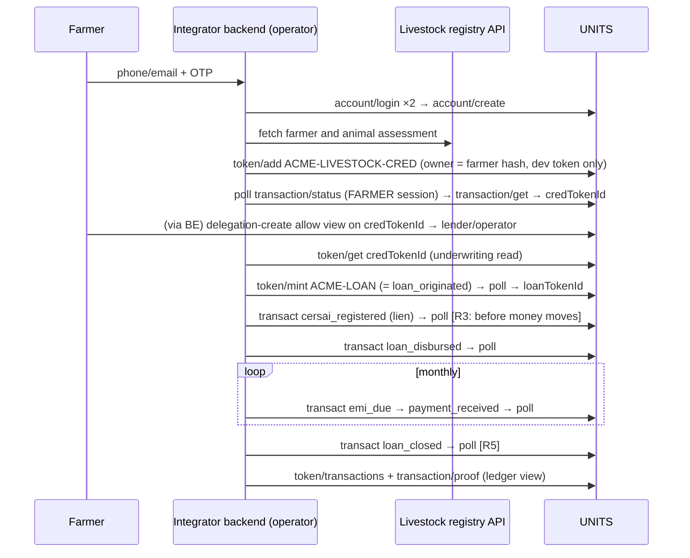
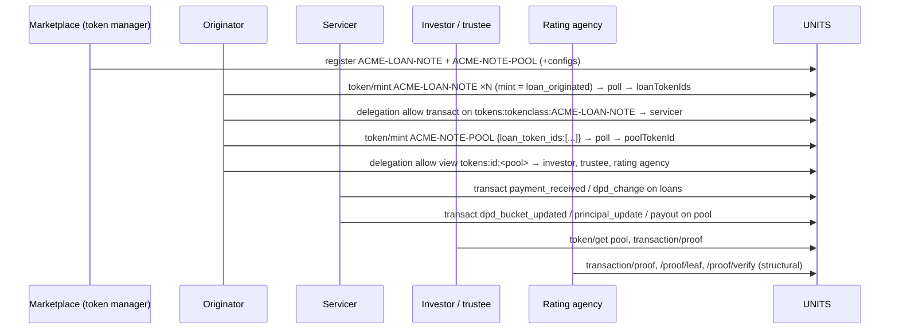

# UNITS worked examples

These scenarios show every call's full request JSON. Snapshot: 2026-10-03.

**Status labels** (each step is marked):
- **LIVE-VERIFIED**: exercised against sanctum in Aug 2026.
- **CODE**: matches the current units-api and token-runtime code, but was not exercised live.
- **DESIGN**: proposed only; it will not work as written today.

Where live behaviour and code differ, the step says **environment-dependent**. Check your own instance with `/v1/tokenclassconfig/get` and `/v1/tokenprogram/search`.

Read first: [integration-playbook.md](integration-playbook.md) (the protocol, polling and error matrix) and [token-classes.md](token-classes.md) (class design). Class payload files are in `../examples/token-classes/`.

## Conventions used below

Every request is `POST {UNITS_BASE_URL}{path}` with `Content-Type: application/json`. The envelope is written in full, with the `context` on one line:

```json
{"context":{"id":"api.token.mint","version":"1.0","ts":"2026-10-03T10:00:00Z","msgId":"<fresh uuid>","developerToken":"<DEV_TOKEN>","authorization":"Bearer <OPERATOR_JWT>","valueFormat":"raw"},
 "payload":{...},
 "signature":{"keyId":"<OPERATOR_KEY_ID>","jws":"<base64 Ed25519 over JCS(payload)>"}}
```

- `<DEV_TOKEN>`: your developer token. `<X_JWT>`: a session JWT for account X.
- `<OPERATOR_KEY_ID>`: the id returned by `/v1/account/keys/register` for the operator's Ed25519 key. The `signature` block is only shown on `/v1/token/transact`, where the instance may require it. Signature enforcement is environment-dependent, so always build signing in.
- Write responses look like `{"context":{...,"status":"successful"|"accepted","transactionId":"<txId>"},"response":{"txId":"<txId>","status":"submitted",...}}`. **Every write must then be polled:**
  ```json
  {"context":{"id":"api.transaction.status","version":"1.0","ts":"...","msgId":"<uuid>","developerToken":"<DEV_TOKEN>","authorization":"Bearer <POLLER_JWT>"},
   "payload":{"txId":"<txId>"}}
  ```
  Poll until `response.status` is `completed`, `failed` or `cancelled`. Then, for creation operations, call `/v1/transaction/get {"txId"}` and read `response.metadata.token_id`, then `metadata.affectedTokenIds[0]`, then legacy `responseData.tokenId` / `.id` (`api-reference.md` §5.5.2).
- `context.valueFormat:"raw"` is sent on every mint and transact below, including ones that carry no amount, so your client can always set it.
- **Class names are global across tenants.** Rename `ACME-*` to your own prefix.
- **Loan amount fields are environment-dependent.** Current code (refactor #220) uses `data.value`. Older builds used `data.amount`. Send `value`; if the poll fails with a missing or unknown field error, resend with `amount`.

---

## A. Livestock-backed agricultural loan (illustrative)

**Story.** A livestock registry assesses a farmer's cow and produces an asset score. The assessment becomes a soulbound credential. A lender then originates a loan backed by the cow, records a lien, disburses, collects EMIs and closes the loan. The core UNITS mechanics were live-verified against sanctum.

**Actors**

| Actor | UNITS account | Does |
|---|---|---|
| Integrator operator (livestock registry / lender ops) | `acme-agri-ops` (BUSINESS) | Owns the classes. Performs all loan writes. Signs transacts. |
| Farmer | `farmer-7c1e2a.acme` (PERSONAL), created by OTP signup | Owns the credential. Reads it. Grants consent. |
| Lender | In this example, all lender writes run through the operator | In production, give each lender its own account and class issuer rights, or delegations. |

**Token classes.** Both are registered by the operator; the full files are in `examples/token-classes/`.

```json
// A1 /v1/tokenclass/register  — credential class
{"context":{"id":"api.tokenclass.register","version":"1.0","ts":"2026-10-03T09:00:00Z","msgId":"<uuid>","developerToken":"<DEV_TOKEN>","authorization":"Bearer <OPERATOR_JWT>"},
 "payload":{"tokenClass":"ACME-LIVESTOCK-CRED","tokenStandard":"UNITS-CREDENTIAL","name":"ACME Livestock Assessment Credential",
   "description":"Soulbound credential attesting a livestock asset-score assessment.",
   "schema":{"type":"object"},
   "metadata":{"fungible":false,"transferable":false,"soulbound":true,"revocable":true,"category":"credential"}}}
// -> 200 {"response":{"id":"01a0aaaa-...-cred","tokenClass":"ACME-LIVESTOCK-CRED",...}}

// A2 /v1/tokenclassconfig/register
{"context":{"id":"api.tokenclassconfig.register","version":"1.0","ts":"2026-10-03T09:00:01Z","msgId":"<uuid>","developerToken":"<DEV_TOKEN>","authorization":"Bearer <OPERATOR_JWT>"},
 "payload":{"tokenClass":"ACME-LIVESTOCK-CRED","tokenClassId":"01a0aaaa-...-cred","programId":"credential","preHooks":[]}}

// A3 /v1/tokenclass/register  — loan class
{"context":{"id":"api.tokenclass.register","version":"1.0","ts":"2026-10-03T09:00:02Z","msgId":"<uuid>","developerToken":"<DEV_TOKEN>","authorization":"Bearer <OPERATOR_JWT>"},
 "payload":{"tokenClass":"ACME-LOAN","tokenStandard":"UNITS-Loan","name":"ACME Loan Note",
   "description":"One token per loan account; full lifecycle from origination to closure.",
   "schema":{"type":"object"},
   "metadata":{"fungible":false,"symbol":"ACMELOAN","category":"loan","transferable":false,"valueCurrency":"INR"}}}

// A4 /v1/tokenclassconfig/register
{"context":{"id":"api.tokenclassconfig.register","version":"1.0","ts":"2026-10-03T09:00:03Z","msgId":"<uuid>","developerToken":"<DEV_TOKEN>","authorization":"Bearer <OPERATOR_JWT>"},
 "payload":{"tokenClass":"ACME-LOAN","tokenClassId":"01a0bbbb-...-loan","programId":"loan-nft-program",
   "preHooks":[{"hookId":"logging","priority":20,"enabled":true}],"postHooks":[{"hookId":"logging","priority":1,"enabled":true}],
   "config":{"stateCommitmentAlgorithm":"sha256"}}}
```

These four calls are synchronous: no polling. LIVE-VERIFIED.

**Operator one-time key setup.** Required for signed transacts.

```json
// A5 /v1/account/keys/register  (public key = 32-byte Ed25519 raw key, hex)
{"context":{"id":"api.account.keys.register","version":"1.0","ts":"2026-10-03T09:01:00Z","msgId":"<uuid>","developerToken":"<DEV_TOKEN>","authorization":"Bearer <OPERATOR_JWT>"},
 "payload":{"publicKey":"8060efe3088473cf9c50e51e5b47659ef017569fee51df2efe16d829dad7828a","type":"ed25519","name":"acme-agri-ops envelope key"}}
// -> 201 {"response":{"id":"<OPERATOR_KEY_ID>","type":"ed25519","status":"active",...}}
```

**Call sequence**



**A6–A8. Farmer signup** (LIVE-VERIFIED)

```json
// A6 send OTP
{"context":{"id":"api.account.login","version":"1.0","ts":"2026-10-03T10:00:00Z","msgId":"<uuid>","developerToken":"<DEV_TOKEN>"},
 "payload":{"username":"+919800000001"}}
// A7 verify OTP (sandbox: 123456)
{"context":{"id":"api.account.login","version":"1.0","ts":"2026-10-03T10:00:30Z","msgId":"<uuid>","developerToken":"<DEV_TOKEN>"},
 "payload":{"username":"+919800000001","otp":"123456"}}
// -> {"response":{"accessToken":"<OTP_JWT>","tokenType":"Bearer","expiresIn":...,"isExisting":false}}
// A8 create account (authorization = the OTP JWT)
{"context":{"id":"api.account.create","version":"1.0","ts":"2026-10-03T10:00:40Z","msgId":"<uuid>","developerToken":"<DEV_TOKEN>","authorization":"Bearer <OTP_JWT>"},
 "payload":{"address":"farmer-7c1e2a.acme","name":"Test Farmer","entityType":"PERSONAL"}}
// -> {"response":{"accessToken":"<FARMER_JWT>","refreshToken":"...","expiresIn":36000,"refreshExpiresIn":1800}}
// STORE: address "farmer-7c1e2a.acme", addressHash = sha256("farmer-7c1e2a.acme") = "<FARMER_HASH>"
```

**A9. Issue the livestock credential: `/v1/token/add`** (LIVE-VERIFIED; no user JWT)

The deployed `credentialSubject` is a closed, KYC-shaped schema. Map the livestock data onto it:
- `documentType` = `"LivestockAssessment"`
- `documentNumber` = the animal id
- `faceMatch*` = an animal biometric (muzzle) match

All the real domain data goes in `evidence[].rawPayload`. Hash mutable media URLs when you ingest them.

```json
{"context":{"id":"api.token.add","version":"1.0","ts":"2026-10-03T10:05:00Z","msgId":"<uuid>","developerToken":"<DEV_TOKEN>"},
 "payload":{
  "tokenClass":"ACME-LIVESTOCK-CRED",
  "owner":"<FARMER_HASH>",
  "credential":{
    "@context":["https://www.w3.org/ns/credentials/v2"],
    "type":["VerifiableCredential","LivestockAssessmentCredential"],
    "issuer":"did:units:acme-agri-registry",
    "validFrom":"2026-10-03T10:05:00Z",
    "validUntil":"2027-10-03T00:00:00Z",
    "credentialSubject":{
      "id":"<FARMER_HASH>",
      "documentType":"LivestockAssessment",
      "documentNumber":"ANIMAL-000123",
      "country":"IN",
      "givenName":"NANDINI",
      "address":"12.971600,77.594600",
      "faceMatchVerified":true,
      "faceMatchPercentage":"97"
    },
    "evidence":[{
      "type":["LivestockAssessmentEvidence"],
      "rawPayload":{
        "farmerId":"farmer123","animalId":"ANIMAL-000123","animalName":"NANDINI",
        "assetScore":"812","healthScore":"88","muzzleScore":"97","herdAssetScore":"760",
        "animalValue":"63000","species":"cow","ageInYears":"2-3","pregnancyStatus":"Yes",
        "noOfMonthsPregnant":"6","daysSinceLastCalving":"250","capturedAt":"2026-10-01T18:58:49Z",
        "geo":{"lat":"12.971600","lng":"77.594600"},
        "evidence":{"assessmentReportSha256":"<sha256>","cashflowReportSha256":"<sha256>"},
        "lien":{"status":"none"}
      }
    }]
  },
  "metadata":{"name":"Livestock Assessment — NANDINI","tokenStandard":"UNITS-CREDENTIAL"}
 }}
// -> {"response":{"txId":"<TX_CRED>","status":"submitted","message":"credential_add_transaction_submitted",...}}
```

Next:
1. Poll `<TX_CRED>` **with `<FARMER_JWT>`**. The operator session gets FORBIDDEN.
2. Call `/v1/transaction/get {"txId":"<TX_CRED>"}`, also with the farmer's JWT, to get `<CRED_TOKEN_ID>` from `metadata.token_id` (then `metadata.affectedTokenIds[0]`, then legacy `responseData.tokenId`; see `api-reference.md` §5.5.2).

The fallback is `/v1/token/search`:

```json
{"context":{"id":"api.token.search","version":"1.0","ts":"...","msgId":"<uuid>","developerToken":"<DEV_TOKEN>","authorization":"Bearer <FARMER_JWT>"},
 "payload":{"filters":{"tokenClass":"ACME-LIVESTOCK-CRED"},"pagination":{"limit":1,"offset":0},"sortBy":{"field":"createdAt","order":"desc"}}}
```

**A10. Consent: the farmer lets the operator or lender read the credential** (CODE)

Underwriting can read the credential with the farmer's session, but in production take explicit consent:

```json
{"context":{"id":"api.workflow.execute","version":"1.0","ts":"2026-10-03T10:10:00Z","msgId":"<uuid>","developerToken":"<DEV_TOKEN>","authorization":"Bearer <FARMER_JWT>"},
 "payload":{"workflow":"delegation-create","action":"allow",
   "data":{"grantee_address":"acme-agri-ops","label":"tokens:id:<CRED_TOKEN_ID>","permission":"view","expires_at":"2027-10-03T00:00:00Z"}}}
// -> 202 {"response":{"delegation_id":"<uuid>","status":"pending"}}   (owner grant; becomes active within seconds)
```

**A11. Underwriting read** (LIVE-VERIFIED with the farmer's JWT; CODE with the delegated operator JWT)

```json
{"context":{"id":"api.token.get","version":"1.0","ts":"2026-10-03T10:11:00Z","msgId":"<uuid>","developerToken":"<DEV_TOKEN>","authorization":"Bearer <OPERATOR_JWT>","valueFormat":"raw"},
 "payload":{"tokenId":"<CRED_TOKEN_ID>"}}
```

Check:
- `state.status == "active"`
- now is within `[validFrom, validUntil]`
- the credential really came from your assessor: here the operator added it itself, so match `<CRED_TOKEN_ID>` against the id you stored at A9. A tokenId handed to you by someone else needs the provenance check in C3
- the evidence fields: for example an illustrative approval rule of assetScore ≥ 400, with loanAmount = min(cap, animalValue × 0.6)

**A12. Originate the loan: `/v1/token/mint` on ACME-LOAN** (LIVE-VERIFIED)

On `loan-nft-program`, `mint` is an alias of `loan_originated`, so there is no separate originate transact. The full `LoanOriginatedPayload` goes in `data`:
- u128 fields are integer strings.
- u32 fields are numbers.
- `foir` is `"1"`.
- **Do not send `identities`.**

```json
{"context":{"id":"api.token.mint","version":"1.0","ts":"2026-10-03T10:15:00Z","msgId":"<uuid>","developerToken":"<DEV_TOKEN>","authorization":"Bearer <OPERATOR_JWT>","valueFormat":"raw"},
 "payload":{
  "tokenClass":"ACME-LOAN",
  "initialSupply":"1",
  "metadata":{"name":"LOAN-2026-7c1e2a — ACME Agri Finance","fungible":false},
  "data":{
    "loanRefId":"LOAN-2026-7c1e2a","loanAmount":"37800","currency":"INR",
    "loanType":"LivestockBackedLoan","program":"AcmeLivestockLoan","sourcingState":"TN",
    "originationDate":"2026-10-03","sanctionDate":"2026-10-03","firstEmiDate":"2026-11-05",
    "interestRateType":"Fixed","collateralType":"Livestock",
    "borrowerId":"<FARMER_HASH>","coBorrowerIds":[],"guarantorIds":[],
    "productCode":"LIVESTOCK-LOAN-01",
    "disbursementSchedule":[{"tranche":1,"plannedDate":"2026-10-03","plannedAmount":"37800"}],
    "prepaymentLockInMonths":0,"cersaiApplicable":true,
    "interestRate":"12","tenure":24,"emiDay":5,"emiPerMonth":"1779",
    "maturityDate":"2028-10-05","foir":"1","penalRate":"2"
  }
 }}
// -> {"response":{"txId":"<TX_LOAN>","status":"submitted","message":"domain_lifecycle_workflow_submitted","estimatedCompletionTime":"..."}}
```

- `emiPerMonth` = round(P·r / (1 − (1+r)^−n)) with r = 12/1200 and n = 24.
- `borrowerId` can be a DID. Any stable reference works; prefer a hash (DPDP).
- Poll `<TX_LOAN>` with the operator's JWT, then resolve `<LOAN_TOKEN_ID>`. The fallback search is narrowed with `"data.loanRefId":"LOAN-2026-7c1e2a"`.

**A13. Lien: `cersai_registered`** (LIVE-VERIFIED)

There is no generic asset or lien program, so the lien record is the CERSAI registration on the loan token. Rule R3: it must reach `completed` before any money moves.

```json
{"context":{"id":"api.token.transact","version":"1.0","ts":"2026-10-03T10:20:00Z","msgId":"<uuid>","developerToken":"<DEV_TOKEN>","authorization":"Bearer <OPERATOR_JWT>","valueFormat":"raw"},
 "payload":{"operation":"cersai_registered","tokenId":"<LOAN_TOKEN_ID>",
   "data":{"regNumber":"CERSAI-LOAN-2026-7c1e2a-4970b","cersaiDate":"2026-10-03"}},
 "signature":{"keyId":"<OPERATOR_KEY_ID>","jws":"<b64>"}}
// -> 202 {"response":{"txId":"<TX_LIEN>","status":"submitted","workflowInstanceId":"<TX_LIEN>"}}
```

Notes:
- It requires `cersaiApplicable:true` at origination.
- A second `cersai_registered` fails; use `cersai_modified {newRegNumber?, amendmentDate, reason}` instead.

**A14. Disbursement: `loan_disbursed`** (LIVE-VERIFIED with `amount`; current code uses `value`, so this is environment-dependent)

```json
{"context":{"id":"api.token.transact","version":"1.0","ts":"2026-10-03T10:25:00Z","msgId":"<uuid>","developerToken":"<DEV_TOKEN>","authorization":"Bearer <OPERATOR_JWT>","valueFormat":"raw"},
 "payload":{"operation":"loan_disbursed","tokenId":"<LOAN_TOKEN_ID>",
   "data":{"tranche":1,"value":"37800","date":"2026-10-03","txId":"DISB-LOAN-2026-7c1e2a",
           "newDisbursementAmount":"37800","newPrincipalOutstanding":"37800","newDisbursementStatus":"Full"}},
 "signature":{"keyId":"<OPERATOR_KEY_ID>","jws":"<b64>"}}
```

On older builds, replace `"value":"37800"` with `"amount":"37800"`.

**A15. EMI due and payment** (CODE; payment fields per the current `PaymentReceivedPayload`)

The program is "trust-payload": your LMS computes the new totals, and the program copies them in.

```json
// emi_due
{"context":{"id":"api.token.transact","version":"1.0","ts":"2026-11-01T06:00:00Z","msgId":"<uuid>","developerToken":"<DEV_TOKEN>","authorization":"Bearer <OPERATOR_JWT>","valueFormat":"raw"},
 "payload":{"operation":"emi_due","tokenId":"<LOAN_TOKEN_ID>",
   "data":{"emiDate":"2026-11-05","emiNumber":1,"expectedAmount":"1779","nextEmiDate":"2026-12-05"}},
 "signature":{"keyId":"<OPERATOR_KEY_ID>","jws":"<b64>"}}

// payment_received
{"context":{"id":"api.token.transact","version":"1.0","ts":"2026-11-05T12:00:00Z","msgId":"<uuid>","developerToken":"<DEV_TOKEN>","authorization":"Bearer <OPERATOR_JWT>","valueFormat":"raw"},
 "payload":{"operation":"payment_received","tokenId":"<LOAN_TOKEN_ID>",
   "data":{"value":"1779","paymentDate":"2026-11-05","paymentType":"FullEMI",
           "towards":{"principal":"1401","interest":"378","charges":"0"},
           "newPrincipalOutstanding":"36399","newOverdueAmount":"0","newDpd":0,"newEmisPaid":1,
           "newLoanEntityStatus":"Active"}},
 "signature":{"keyId":"<OPERATOR_KEY_ID>","jws":"<b64>"}}
```

`paymentType` is one of `FullEMI`, `PartialEMI`, `PrePayment`, `ForeclosurePayment` or `ChargePayment`. For delinquency, use:

```json
{"operation":"dpd_change","tokenId":"<LOAN_TOKEN_ID>","data":{"dpd":31,"reason":"missed_emi","effectiveDate":"2027-01-05","newLoanEntityStatus":"Delinquent"}}
```

**A16. Closure: `loan_closed`** (CODE)

The loan must be Active or Delinquent for Regular or Prepayment closure. An NPA loan must first be written off, or moved back to Delinquent.

```json
{"context":{"id":"api.token.transact","version":"1.0","ts":"2028-10-05T12:00:00Z","msgId":"<uuid>","developerToken":"<DEV_TOKEN>","authorization":"Bearer <OPERATOR_JWT>","valueFormat":"raw"},
 "payload":{"operation":"loan_closed","tokenId":"<LOAN_TOKEN_ID>",
   "data":{"closureData":{"date":"2028-10-05","closureType":"Regular","finalSettlementAmount":"1779"},"closureReason":"fully_repaid"}},
 "signature":{"keyId":"<OPERATOR_KEY_ID>","jws":"<b64>"}}
```

After this, record the lien release in your system (R5). There is no `lien_released` operation on loan-nft. Optionally run `cersai_modified` with `reason:"satisfaction_filed"`. The token is not burned; it stays as a permanent record.

**A17. Ledger and proof** (LIVE-VERIFIED for search; proofs return `pending`)

```json
{"context":{"id":"api.token.transactions","version":"1.0","ts":"...","msgId":"<uuid>","developerToken":"<DEV_TOKEN>","authorization":"Bearer <OPERATOR_JWT>"},
 "payload":{"filters":{"tokenId":"<LOAN_TOKEN_ID>"},"pagination":{"limit":50,"offset":0},"sortBy":{"field":"createdAt","order":"desc"}}}

{"context":{"id":"api.transaction.proof","version":"1.0","ts":"...","msgId":"<uuid>","developerToken":"<DEV_TOKEN>","authorization":"Bearer <OPERATOR_JWT>"},
 "payload":{"txId":"<TX_LIEN>"}}
```

Store `stateCommitment` per step as your "proof hash" column. Claim "hash-chained, tamper-evident", not "anchored".

**Expected statuses**

| Call | Sync response | Poll |
|---|---|---|
| A1–A5 | `successful` | n/a |
| A9, A12 | `successful` + `{txId, status:"submitted"}` | `completed` |
| A13–A16 | 202 `accepted` | `completed` |

**What this example leaves outside UNITS, and why**

| Step | Status | Reason |
|---|---|---|
| Registry onboarding and asset-score API | Off-ledger | Your own integration with the registry; not a UNITS call. |
| Lender discovery and offers | Off-ledger | UNITS has no discovery or broadcast layer. |
| Consent | Your UI | Delegations exist (A10); wire them in production. |
| Lenders as separate accounts | Simplified | All lender writes go through the operator in this example. |
| Standalone LIVESTOCK-ASSET token carrying the lien | Not built | No generic asset/lien program on sanctum, so the lien = `cersai_registered` on the loan. |
| Purpose voucher issue to the farmer, and category spend | Design-around | `purpose-bound-voucher` cannot be minted; fungible transfer failed with `recipient_address_not_found`. See F. |

**Pitfalls**
- Sending `identities` on the loan mint.
- Decimal rates (`"12.29"`).
- `foir:"0"`.
- Polling the credential tx as the operator.
- Forgetting tokenclassconfig.
- `entityType:"Individual"`.
- A farmer who already has an account: you cannot obtain their hash unless you stored it, or they tell you their address.
- Sending `amount` versus `value` to the wrong build.

---

## B. Loan securitisation marketplace (illustrative)

**Story.** Originators mint one loan-note token per loan. A token manager (the marketplace operator) owns the classes and the hooks. A servicer posts collections. A pool token links to its loans. Investors and trustees read and verify. A rating agency audits through the proof APIs. This is design guidance built on the shipped `loan-nft-program` and `loan-pool-nft-program`, which have been exercised by tests but not live. (CODE)

**Roles → UNITS calls**

| Role | Account | Calls |
|---|---|---|
| Token manager (marketplace) | `market-tm` | `tokenclass/register`, `tokenclassconfig/register` |
| Originator (NBFC) | `nbfc-a` | `token/mint` loans; `token/mint` the pool; grants delegations |
| Servicer | `servicer-x` | `token/transact` loan ops and pool ops, through a delegation |
| Investor / trustee | `mf-investor`, `acme-trustee` | `token/get`, `transaction/proof`, through a view delegation |
| Rating agency | `rating-co` | `transaction/proof`, `proof/leaf`, `proof/verify` |

**Classes.** Multiple minters are declared through class `identities` with **plaintext** addresses, which are hashed on store. Because `identities` is supplied, also include the token manager as `owner`. Check on your instance that the registering account keeps manage rights.

```json
// B1 loan-note class
{"context":{"id":"api.tokenclass.register","version":"1.0","ts":"2026-10-03T09:00:00Z","msgId":"<uuid>","developerToken":"<DEV_TOKEN>","authorization":"Bearer <TM_JWT>"},
 "payload":{"tokenClass":"ACME-LOAN-NOTE","tokenStandard":"UNITS-Loan","name":"ACME Loan Note",
   "description":"One token per loan offered for sell-down; borrower held as hashed reference.",
   "schema":{"type":"object"},
   "identities":[{"id":"market-tm","type":"owner"},{"id":"nbfc-a","type":"issuer"},{"id":"nbfc-b","type":"issuer"}],
   "metadata":{"fungible":false,"category":"loan","transferable":false,"valueCurrency":"INR"}}}
// B2 config (loan-nft-program) — same shape as A4 with tokenClass ACME-LOAN-NOTE

// B3 pool class
{"context":{"id":"api.tokenclass.register","version":"1.0","ts":"2026-10-03T09:00:05Z","msgId":"<uuid>","developerToken":"<DEV_TOKEN>","authorization":"Bearer <TM_JWT>"},
 "payload":{"tokenClass":"ACME-NOTE-POOL","tokenStandard":"UNITS-LoanPool","name":"ACME Note Pool",
   "description":"PTC / DA pool token with dependency claims on each loan note.",
   "schema":{"type":"object"},
   "identities":[{"id":"market-tm","type":"owner"},{"id":"nbfc-a","type":"issuer"},{"id":"nbfc-b","type":"issuer"}],
   "metadata":{"fungible":false,"category":"loan-pool","transferable":false,"soulbound":true,"valueCurrency":"INR"}}}
// B4 pool config
{"context":{"id":"api.tokenclassconfig.register","version":"1.0","ts":"2026-10-03T09:00:06Z","msgId":"<uuid>","developerToken":"<DEV_TOKEN>","authorization":"Bearer <TM_JWT>"},
 "payload":{"tokenClass":"ACME-NOTE-POOL","tokenClassId":"<pool class id>","programId":"loan-pool-nft-program",
   "preHooks":[{"hookId":"logging","priority":20,"enabled":true}],"postHooks":[{"hookId":"logging","priority":20,"enabled":true}],
   "config":{"stateCommitmentAlgorithm":"sha256",
     "additionalStateRequirements":[{"key":"loan_tokens","tokenClass":"ACME-LOAN-NOTE","tokenIdsFrom":"payload.data.loan_token_ids","operations":["mint"],"multiple":true}]}}}
```

The seeded `LOAN-POOL` config uses `tokenIdsFrom:"payload.loan_token_ids"`. Code review suggests that path does not resolve after the engine unwraps the payload. If it doesn't, the requirement is silently skipped: the pool still mints, but the loans get no `LoanPoolMembership` claim and the "N loans found" check is skipped. `payload.data.loan_token_ids` is the suggested fix. **Verify** by reading a member loan's `claims` or `relationships` after the pool mint.

**Sequence**



**B5. Originator mints each loan.** It is the same `LoanOriginatedPayload` as A12; `borrowerId` is a hashed reference.

```json
{"context":{"id":"api.token.mint","version":"1.0","ts":"2026-10-03T11:00:00Z","msgId":"<uuid>","developerToken":"<DEV_TOKEN>","authorization":"Bearer <NBFC_A_JWT>","valueFormat":"raw"},
 "payload":{"tokenClass":"ACME-LOAN-NOTE","initialSupply":"1","metadata":{"name":"LN20260001"},
  "data":{"loanRefId":"LN20260001","loanAmount":"500000","currency":"INR","loanType":"HomeLoan","program":"PMAY",
    "sourcingState":"MH","originationDate":"2026-03-07","sanctionDate":"2026-03-01","firstEmiDate":"2026-04-01",
    "interestRateType":"Floating","collateralType":"Immovable","borrowerId":"sha256:9f2c...","coBorrowerIds":[],"guarantorIds":[],
    "productCode":"HL-001","disbursementSchedule":[{"tranche":1,"plannedDate":"2026-03-10","plannedAmount":"500000"}],
    "prepaymentLockInMonths":12,"lockInRestriction":"NoForeclosure","cersaiApplicable":true,
    "interestRate":"9","tenure":240,"emiDay":1,"emiPerMonth":"4496","maturityDate":"2046-03-01",
    "foir":"1","penalRate":"2","benchmark":"REPO","spread":"250","ltvRatio":"7500"}}}
```

Repeat for `LN20260002`. Poll each with `<NBFC_A_JWT>` and resolve `<LOAN_1>` and `<LOAN_2>`.

`foir` is an integer string from 1 to 10000, in basis points. `"1"` (live-verified) is valid everywhere; `"4500"` means 45%. The error text "foir must be in (0, 1]" is misleading.

**B6. Originator lets the servicer transact on its loans**

```json
{"context":{"id":"api.workflow.execute","version":"1.0","ts":"2026-10-03T11:05:00Z","msgId":"<uuid>","developerToken":"<DEV_TOKEN>","authorization":"Bearer <NBFC_A_JWT>"},
 "payload":{"workflow":"delegation-create","action":"allow",
   "data":{"grantee_address":"servicer-x","label":"tokens:tokenclass:ACME-LOAN-NOTE","permission":"transact","expires_at":"2027-03-31T23:59:59Z"}}}
```

**B7. Pool mint.** The data keys are **snake_case**, money values are **strings**, and the guarantee key is `FLDG` in upper case.

```json
{"context":{"id":"api.token.mint","version":"1.0","ts":"2026-10-03T11:10:00Z","msgId":"<uuid>","developerToken":"<DEV_TOKEN>","authorization":"Bearer <NBFC_A_JWT>","valueFormat":"raw"},
 "payload":{"tokenClass":"ACME-NOTE-POOL","initialSupply":"1",
  "data":{"pool_ref_id":"POOL-2027-A","pool_type":"PassThroughCertificate",
    "loan_token_ids":["<LOAN_1>","<LOAN_2>"],"loan_count":2,
    "originator_id":"nbfc-a","trustee_id":"acme-trustee","investor_id":"mf-investor",
    "cutoff_date":"2026-09-30","total_pool_amount":"1000000","min_seasoning_months":6,
    "expected_maturity_date":"2046-03-31","payout_day":"15","investor_share":"0.90",
    "active_loan_count":2,"delinquent_loan_count":0,"npa_loan_count":0,"closed_loan_count":0,"written_off_loan_count":0,
    "pool_outstanding":"950000","investor_os":"855000","FLDG":"50000",
    "dpd_bucket_distribution":{"current_count":2,"dpd_1_30_count":0,"dpd_31_60_count":0,"dpd_61_90_count":0,"dpd_90_plus_count":0,
       "dpd_1_30_amount":"0","dpd_31_60_amount":"0","dpd_61_90_amount":"0","dpd_90_plus_amount":"0"},
    "current_rating":"AAA"}}}
```

The program validates:
- `total_pool_amount` is a positive integer string.
- `loan_count == len(loan_token_ids)`.
- The five status counts sum to `loan_count`.
- A PassThroughCertificate has a `trustee_id`.

It does **not** check loan ownership, seasoning, or membership in another pool. Do those checks yourself. The pool token gets one `PoolLoanDependency` claim per loan.

**B8. Servicing.** These are signed transacts by the servicer, through the delegation from B6.

```json
// loan level
{"context":{"id":"api.token.transact","version":"1.0","ts":"2026-11-02T08:00:00Z","msgId":"<uuid>","developerToken":"<DEV_TOKEN>","authorization":"Bearer <SERVICER_JWT>","valueFormat":"raw"},
 "payload":{"operation":"payment_received","tokenId":"<LOAN_1>",
   "data":{"value":"4496","paymentDate":"2026-11-01","paymentType":"FullEMI","towards":{"principal":"1246","interest":"3250","charges":"0"},
           "newPrincipalOutstanding":"498754","newOverdueAmount":"0","newDpd":0,"newEmisPaid":8,"newLoanEntityStatus":"Active"}},
 "signature":{"keyId":"<SERVICER_KEY_ID>","jws":"<b64>"}}

// pool level (needs a transact delegation on the pool too, e.g. label tokens:id:<POOL>)
{"context":{"id":"api.token.transact","version":"1.0","ts":"2026-11-02T09:00:00Z","msgId":"<uuid>","developerToken":"<DEV_TOKEN>","authorization":"Bearer <SERVICER_JWT>","valueFormat":"raw"},
 "payload":{"operation":"dpd_bucket_updated","tokenId":"<POOL>",
   "data":{"active_loan_count":1,"delinquent_loan_count":1,"npa_loan_count":0,"closed_loan_count":0,"written_off_loan_count":0,
     "dpd_bucket_distribution":{"current_count":1,"dpd_1_30_count":1,"dpd_31_60_count":0,"dpd_61_90_count":0,"dpd_90_plus_count":0,
       "dpd_1_30_amount":"500000","dpd_31_60_amount":"0","dpd_61_90_amount":"0","dpd_90_plus_amount":"0"}}},
 "signature":{"keyId":"<SERVICER_KEY_ID>","jws":"<b64>"}}
```

Other pool operations use the same envelope, with `data`:

| Operation | `data` |
|---|---|
| `principal_update` | `{"principal_collected":"25000"}` |
| `payout` | `{"payout_amount":"22500","pool_outstanding":"925000"}`. It records an off-ledger payout, and `payout_amount` must be ≤ `investor_os`. |
| `irr_update` | `{"internal_rate_of_return":"9.25"}` |
| `fldg_update` | `{"new_fldg":"45000"}` |
| `pool_rating_updated` | `{"new_rating":"AA+"}` (`null` withdraws the rating) |
| `pool_closed` | `{"closure_date":"2046-03-31","closure_reason":"All loans settled"}` |

**B9. Investor and rating-agency verification**

```json
{"context":{"id":"api.token.get","version":"1.0","ts":"...","msgId":"<uuid>","developerToken":"<DEV_TOKEN>","authorization":"Bearer <INVESTOR_JWT>","valueFormat":"raw"},
 "payload":{"tokenId":"<POOL>"}}
{"context":{"id":"api.transaction.proof","version":"1.0","ts":"...","msgId":"<uuid>","developerToken":"<DEV_TOKEN>","authorization":"Bearer <RATING_JWT>"},
 "payload":{"txId":"<pool mint txId>"}}
```

These need a prior `view` delegation from the owner on `tokens:id:<POOL>` (or on the class).

**Expected statuses.** Registers return `successful`. Mints return `successful` + submitted, then poll to `completed`. Transacts return 202, then poll to `completed`.

**Pitfalls**
- Pool keys must be snake_case and loan keys camelCase.
- Numbers instead of strings in pool money fields fail with `invalid type: integer, expected a string`.
- Using `fldg` instead of `FLDG`.
- Loan and pool tokens **cannot be transferred**. Sell-down is recorded through your own operations and delegations, not through `transfer`.
- Trust-payload: `payment_received` can set any `loanEntityStatus`, so validate in your LMS.
- The use-case narrative in the public docs (senior/mezz/equity tranches, float money) does not match the shipped pool program (DPD buckets, IRR, FLDG, string amounts).

---

## C. KYC credential issued by a provider, verified by a third party with consent

**Story.** A KYC provider (ACME) verifies a user and issues a soulbound credential. A lender app, with its own UNITS account, later verifies it with the user's consent. Issuance is LIVE-VERIFIED (same mechanics as A9); the delegation and verification steps are CODE.

**Actors**

| Actor | Account |
|---|---|
| KYC provider (operator) | `acme-kyc-ops` (BUSINESS) |
| User | `asha.k` (PERSONAL), hash `<ASHA_HASH>` |
| Verifier (lender app) | `lendco-verifier` (BUSINESS) |

**Class.** `examples/token-classes/acme-kyc.credential.json` (program `credential`, standard `UNITS-CREDENTIAL`), registered with `<KYC_OPS_JWT>` as in A1 and A2.

**C1. Issue: `/v1/token/add`** (sessionless; `owner` is the user's hash)

```json
{"context":{"id":"api.token.add","version":"1.0","ts":"2026-10-03T12:00:00Z","msgId":"<uuid>","developerToken":"<DEV_TOKEN>"},
 "payload":{"tokenClass":"ACME-KYC","owner":"<ASHA_HASH>",
  "credential":{"@context":["https://www.w3.org/ns/credentials/v2"],
    "type":["VerifiableCredential","KYCCredential"],
    "issuer":{"id":"did:units:acme-kyc","name":"ACME KYC Services"},
    "validFrom":"2026-10-03T12:00:00Z","validUntil":"2027-10-03T12:00:00Z",
    "credentialSubject":{"id":"<ASHA_HASH>","documentType":"PAN","documentNumber":"XXXXX1234X","country":"IN",
      "givenName":"Asha","familyName":"K","faceMatchVerified":true,"faceMatchPercentage":"96.4"},
    "evidence":[{"type":["KycCheck"],"rawPayload":{"provider":"acme","checkId":"KYC-88231","level":"full","amlScreen":"clear"}}]},
  "metadata":{"name":"KYC — Asha K","tokenStandard":"UNITS-CREDENTIAL"}}}
```

Next:
1. Poll with `<ASHA_JWT>`. The user is usually present at issuance, so capture their session then.
2. Resolve `<KYC_TOKEN_ID>`.
3. A second add for the same token fails with "Credential already exists". Treat that as success.

**C2. User consents to the verifier** (signed in through your app)

```json
{"context":{"id":"api.workflow.execute","version":"1.0","ts":"2026-10-03T12:05:00Z","msgId":"<uuid>","developerToken":"<DEV_TOKEN>","authorization":"Bearer <ASHA_JWT>"},
 "payload":{"workflow":"delegation-create","action":"allow",
   "data":{"grantee_address":"lendco-verifier","label":"tokens:id:<KYC_TOKEN_ID>","permission":"view","expires_at":"2026-11-03T00:00:00Z"}}}
```

**C3. Verifier checks access, then reads**

```json
{"context":{"id":"api.delegations.check","version":"1.0","ts":"2026-10-03T12:06:00Z","msgId":"<uuid>","developerToken":"<VERIFIER_DEV_TOKEN>","authorization":"Bearer <VERIFIER_JWT>"},
 "payload":{"tokenId":"<KYC_TOKEN_ID>"}}
// -> {"response":{"tokenId":"...","permissions":{"view":{"allowed":true,"source":"delegation","delegationId":"..."},...}}}

{"context":{"id":"api.token.get","version":"1.0","ts":"2026-10-03T12:06:05Z","msgId":"<uuid>","developerToken":"<VERIFIER_DEV_TOKEN>","authorization":"Bearer <VERIFIER_JWT>","valueFormat":"raw"},
 "payload":{"tokenId":"<KYC_TOKEN_ID>"}}
```

Verification logic, which is yours to implement:
- `tokenClass == "ACME-KYC"` and `tokenClassInfo.tokenStandard == "UNITS-CREDENTIAL"`.
- `state.status == "active"` (lowercase). Suspended shows as `frozen`; revoked shows as `burned`.
- now is in [`validFrom`, `validUntil`].
- An `owner` identity equals the hash of the user you're dealing with.
- **Provenance.** Validate credential provenance (expected token class, VC `issuer`, provider signature/evidence, and confirmation from the issuing provider) rather than relying on class membership alone. Have ACME put a detached signature in `evidence[].rawPayload` that you verify against ACME's published key, or have ACME confirm the `tokenId`/`txId` to you directly. Details: `token-programs.md` §6.3.
- Optionally, `transaction/proof` for the add tx, and store the commitment.

UNITS does **not** cryptographically verify VC proofs (`ClaimProof.jws` is never checked), and there is no call-back-free DID resolution.

**C4. Lifecycle: suspend, resume, revoke**

```json
{"context":{"id":"api.token.transact","version":"1.0","ts":"2026-12-01T09:00:00Z","msgId":"<uuid>","developerToken":"<DEV_TOKEN>","authorization":"Bearer <ACTOR_JWT>","valueFormat":"raw"},
 "payload":{"operation":"revoke","tokenId":"<KYC_TOKEN_ID>","reason":"document_expired",
   "data":{"reason":"document_expired","revokedBy":"did:units:acme-kyc"}},
 "signature":{"keyId":"<ACTOR_KEY_ID>","jws":"<b64>"}}
```

Other operations take this `data`:
- `suspend`: `{"reason":"under_review","suspendedBy":"did:units:acme-kyc","suspendUntil":"2026-12-15T00:00:00Z"}`. `suspendUntil` is informational only; there is no auto-resume.
- `resume`: `{"reason":"review_cleared","resumedBy":"did:units:acme-kyc"}`.

Revoke is permanent.

**Pitfall (CODE): who may revoke.** After `token/add` (sessionless or not), the token's identities belong to the **holder**. The provider's operator is *not* an identity on the token, so its revoke gets `FORBIDDEN`; revoke, suspend and resume need the holder's session or a delegation from the holder. Options:
- At issuance, have the holder grant the provider `transact` on `tokens:tokenclass:ACME-KYC` (or `tokens:id:<KYC_TOKEN_ID>`). The holder can revoke that delegation later, so keep your own revocation register as the source of truth and tell verifiers to check it.
- Perform revocation with the holder's session.
- Ask Finternet whether newer builds support provider-side revocation, and check `identities` on a test credential.

Plan this before go-live.

**Other pitfalls**
- `credentialSubject` is closed. Fields like `pan` or `aadhaarRef` go in `evidence[].rawPayload`.
- `faceMatchPercentage` is a **string**.
- The verifier needs its own developer token (an API client issued by Finternet, like yours) and its own UNITS account. The delegation is to its **plaintext** address. Cross-instance delegated reads aren't documented, so confirm with Finternet that the verifier is on the same instance or that federation covers it.
- Delegations expire; handle `allowed:false`.
- Do not put raw ID numbers in tokens. Mask them, as `documentNumber` is masked above.

---

## D. Loyalty points (fungible): mint, burn, freeze, lock

**Story.** A retailer issues loyalty points, redeems them and handles compliance holds. Class: `examples/token-classes/acme-pts.fungible.json` (UNITS-FT, `fungible`, decimals 2, max-supply hook). Register and mint are LIVE-VERIFIED (the quickstart path); burn, freeze and lock are CODE.

**D1. Mint the issuer pool.** 1,000,000.00 points = `100000000` base units.

```json
{"context":{"id":"api.token.mint","version":"1.0","ts":"2026-10-03T13:00:00Z","msgId":"<uuid>","developerToken":"<DEV_TOKEN>","authorization":"Bearer <OPERATOR_JWT>","valueFormat":"raw"},
 "payload":{"tokenClass":"ACME-PTS","initialSupply":"100000000",
   "metadata":{"name":"ACME points — treasury","tags":{"pool":"treasury"}},
   "data":{"programRef":"PTS-TREASURY-2026"}}}
```

The same call with `"valueFormat":"display"` would use `"initialSupply":"1000000.00"`. Pick one format and use it everywhere. Poll, then resolve `<PTS_TOKEN_ID>`. The `max-supply` hook rejects mints above `metadata.maxSupply`.

A fungible class keeps **one token per owner**: the engine looks up the minting account's token for this class and tops it up. So every later operator mint adds to this same treasury token; it never creates a second one. `maxSupply` is checked against this token's `totalSupply`, so it is a per-issuer cap, which equals the class cap while you are the only issuer (see `token-programs.md` §4).

**D2. Read the balance**

```json
{"context":{"id":"api.token.search","version":"1.0","ts":"...","msgId":"<uuid>","developerToken":"<DEV_TOKEN>","authorization":"Bearer <OPERATOR_JWT>","valueFormat":"display"},
 "payload":{"filters":{"tokenClass":"ACME-PTS"},"groupBy":["tokenClass"],"aggregateFields":["balance","totalSupply"],
   "pagination":{"limit":50,"offset":0},"sortBy":{"field":"createdAt","order":"desc"}}}
```

**D3. Redeem = burn**

```json
{"context":{"id":"api.token.transact","version":"1.0","ts":"2026-10-04T10:00:00Z","msgId":"<uuid>","developerToken":"<DEV_TOKEN>","authorization":"Bearer <OPERATOR_JWT>","valueFormat":"raw"},
 "payload":{"operation":"burn","tokenId":"<PTS_TOKEN_ID>","value":"25000","reason":"redeem ORDER-8841 cust:<CUST_HASH>"},
 "signature":{"keyId":"<OPERATOR_KEY_ID>","jws":"<b64>"}}
```

Notes:
- The field is `value`. `amount` is rejected synchronously.
- A non-numeric `value` parses to 0, which is a silent no-op burn, so validate before sending.
- An omitted `value` burns the **whole balance**.
- Burn requires the token to be `active` (state status, lowercase) and not locked.

**D4. Compliance hold: freeze and unfreeze** (whole token)

```json
{"context":{"id":"api.token.transact","version":"1.0","ts":"2026-10-05T09:00:00Z","msgId":"<uuid>","developerToken":"<DEV_TOKEN>","authorization":"Bearer <OPERATOR_JWT>","valueFormat":"raw"},
 "payload":{"operation":"freeze","tokenId":"<PTS_TOKEN_ID>","reason":"fraud review case 4411","frozenBy":"acme-risk"},
 "signature":{"keyId":"<OPERATOR_KEY_ID>","jws":"<b64>"}}

{"context":{"id":"api.token.transact","version":"1.0","ts":"2026-10-06T09:00:00Z","msgId":"<uuid>","developerToken":"<DEV_TOKEN>","authorization":"Bearer <OPERATOR_JWT>","valueFormat":"raw"},
 "payload":{"operation":"unfreeze","tokenId":"<PTS_TOKEN_ID>","reason":"case 4411 closed"},
 "signature":{"keyId":"<OPERATOR_KEY_ID>","jws":"<b64>"}}
```

**D5. Lock and unlock** (escrow, earmark)

```json
{"context":{"id":"api.token.transact","version":"1.0","ts":"2026-10-07T09:00:00Z","msgId":"<uuid>","developerToken":"<DEV_TOKEN>","authorization":"Bearer <OPERATOR_JWT>","valueFormat":"raw"},
 "payload":{"operation":"lock","tokenId":"<PTS_TOKEN_ID>","lockedBy":"acme-campaigns","lockUntil":"2026-12-31T23:59:59Z","reason":"year-end campaign reserve"},
 "signature":{"keyId":"<OPERATOR_KEY_ID>","jws":"<b64>"}}

{"context":{"id":"api.token.transact","version":"1.0","ts":"2027-01-02T09:00:00Z","msgId":"<uuid>","developerToken":"<DEV_TOKEN>","authorization":"Bearer <OPERATOR_JWT>","valueFormat":"raw"},
 "payload":{"operation":"unlock","tokenId":"<PTS_TOKEN_ID>","reason":"campaign ended"},
 "signature":{"keyId":"<OPERATOR_KEY_ID>","jws":"<b64>"}}
```

- Without `value`, this is a whole-token lock.
- With `value`, it is a partial "federation lock" keyed to the locking transaction. The engine uses that internally for transfers, and unlocking it requires the original `txnId`/`opSeq`.
- **The whole-token form only works if `min-balance` doesn't apply to `lock`.** ACME-PTS as shipped has no `minBalance`, so it's fine here. If you add `metadata.minBalance` with the `min-balance` hook on `lock` (as `token-classes.md` §6.2 recommends), a lock without `value` fails with `INVALID_PAYLOAD "Could not determine operation value for minBalance check"`. In that case send `value` on every lock, and test unlock on your instance first (`token-programs.md` §4: API-level unlock of a value lock is unverified).
- `lockUntil` does not auto-unlock.

**D6. Update metadata** (client scope `tokens:transact`; resource action `manage`, which the owner has)

```json
{"context":{"id":"api.token.transact","version":"1.0","ts":"...","msgId":"<uuid>","developerToken":"<DEV_TOKEN>","authorization":"Bearer <OPERATOR_JWT>","valueFormat":"raw"},
 "payload":{"operation":"update","tokenId":"<PTS_TOKEN_ID>","metadata":{"name":"ACME points — treasury (FY27)","tags":{"pool":"treasury","fy":"27"}},"data":{"programRef":"PTS-TREASURY-FY27"}},
 "signature":{"keyId":"<OPERATOR_KEY_ID>","jws":"<b64>"}}
```

`update` can change only `name`, `description`, `tags` (replaced wholesale) and `externalUrls`. `data` is shallow-merged.

**D7. Distribute to customers: transfer**

This is environment-dependent. On sanctum in Aug 2026 it failed for every recipient.

```json
{"context":{"id":"api.token.transact","version":"1.0","ts":"...","msgId":"<uuid>","developerToken":"<DEV_TOKEN>","authorization":"Bearer <OPERATOR_JWT>","valueFormat":"raw"},
 "payload":{"operation":"transfer","tokenId":"<PTS_TOKEN_ID>","to":"asha.k","value":"5000"},
 "signature":{"keyId":"<OPERATOR_KEY_ID>","jws":"<b64>"}}
```

- `to` is the recipient's **plaintext** address.
- The transfer runs as a saga: Lock → CreateIncoming → CommitDebit → CommitCredit, with compensations.
- On sanctum it returned `recipient_address_not_found`. A suspected prerequisite is that the recipient has registered keys.

How customer balances work on UNITS: the customer's token is created by the **credit side of a transfer** to them (a holder token with `balance` only). You can't mint into a customer's account, and a second operator mint never creates a second token, because a fungible class keeps one token per owner and the engine tops up the minter's existing one. So "one operator-owned token per customer" is **not possible** on one fungible class. Once customers hold tokens, `min-balance` applies to each holder's own token when they transfer, burn or lock (it never blocks a credit), and also to your treasury. There are no per-holder floors and no exemptions.

Design-around until transfer works on your instance: keep the issuer pool on UNITS (mint, burn with a `reason` such as `"redeem ORDER-8841 cust:<CUST_HASH>"`, proofs) and per-customer balances and the minimum-balance rule in your own system.

**Pitfalls**
- Mixing `raw` and `display`.
- Fungible tokens have no batch identity.
- Zero amounts are accepted.
- Excess fractional digits are truncated silently in `display`.
- A user burn without an issuer `additionalStateRequirements` entry does not credit the issuer pool.
- ERC-20 and ERC-3643 labels select programs only. There are no smart contracts behind them, so do not claim ERC compliance.

---

## E. Stablecoin proxy: import, reconcile, transfer (USDC on Base)

**Story.** A user holds USDC in their own wallet on Base. Your app shows a verified shadow balance in UNITS and records transfers. Use the seeded `USDC` class: program `stables`, and its *stored* identities are `[]`, so any user can import. Alternatively use your own `examples/token-classes/acme-usdc.proxy.json`. On register, `identities: []` behaves like omitted, so you become owner and issuer. To open your own class to all users, set `identities: []` afterwards with `/v1/tokenclass/update`. These steps are CODE. Proxy flows were not exercised live.

| Network | Chain id | USDC contract |
|---|---|---|
| Base mainnet | `eip155:8453` | `0x833589fCD6eDb6E08f4c7C32D4f71b54bdA02913` |
| Base Sepolia | `eip155:84532` | `0x036CbD53842c5426634e7929541eC2318f3dCF7e` |

USDC has 6 decimals: 25 USDC = `"25000000"`.

**E1. User registers their EVM wallet address.** It is a secp256k1 key, identified by address.

```json
{"context":{"id":"api.account.keys.register","version":"1.0","ts":"2026-10-03T14:00:00Z","msgId":"<uuid>","developerToken":"<DEV_TOKEN>","authorization":"Bearer <ASHA_JWT>"},
 "payload":{"address":"0x1234567890abcdef1234567890abcdef12345678","type":"secp256k1","name":"Asha MetaMask","isPrimary":true}}
```

Registering the key can trigger an asynchronous **holdings discovery**, which may auto-import matching proxy tokens. Check `token/search` before importing manually.

**E2. Import: `/v1/token/add`, proxy branch**, with the owner's session.

```json
{"context":{"id":"api.token.add","version":"1.0","ts":"2026-10-03T14:01:00Z","msgId":"<uuid>","developerToken":"<DEV_TOKEN>","authorization":"Bearer <ASHA_JWT>"},
 "payload":{"tokenClass":"USDC","chainId":"eip155:8453",
   "contractAddress":"0x833589fCD6eDb6E08f4c7C32D4f71b54bdA02913",
   "walletAddress":"0x1234567890abcdef1234567890abcdef12345678","value":"25000000"}}
// -> {"response":{"txId":"<TX_IMP>","status":"submitted","message":"proxy_token_import_submitted"}}
```

- The chain adapter checks the on-chain balance. A balance below `value` fails with `InsufficientBalance`.
- Poll with `<ASHA_JWT>` and resolve `<USDC_TOKEN_ID>`.
- `contractAddress` must equal the class's `metadata.contractIds[chainId]`.
- `walletAddress` must be an active key of the owner.

**E3. Reconcile.** Re-send the identical `token/add` with the owner's session. A duplicate (owner, chain, contract, wallet) becomes a `reconcile`, which re-reads the on-chain balance. The response message is `proxy_token_refresh_submitted`. A sessionless duplicate returns `409 CONFLICT`.

**E4. Transfer.** The user first sends USDC on-chain themselves (wallet, wagmi and so on), then records it:

```json
{"context":{"id":"api.token.transact","version":"1.0","ts":"2026-10-03T14:10:00Z","msgId":"<uuid>","developerToken":"<DEV_TOKEN>","authorization":"Bearer <ASHA_JWT>","valueFormat":"raw"},
 "payload":{"operation":"transfer","tokenId":"<USDC_TOKEN_ID>","to":"bob.m","value":"5000000",
   "toAddress":"0xabcdefabcdefabcdefabcdefabcdefabcdefabcd",
   "data":{"chainId":"eip155:8453","txHash":"0x9f2c1d3e4b5a69788796a5b4c3d2e1f00112233445566778899aabbccddeeff0",
           "proxyProof":{"status":"confirmed","blockNumber":21345678}}},
 "signature":{"keyId":"<ASHA_ED25519_KEY_ID>","jws":"<b64>"}}
```

- `to` is the recipient's plaintext UNITS address.
- `toAddress` must be a registered key of the recipient. Otherwise their primary key for the chain family is used.
- The shadow balance must cover `value`.
- **The signature needs an ed25519 key registered by the user.** The secp256k1 wallet key does not sign envelopes.
- If polling returns `awaiting_signature`, `transaction/get.responseData.unsignedTx` holds a chain transaction for the user to sign. `chainTxHash` appears when it is done.

**Pitfalls**
- `proxyProof` is **trusted from the caller**: there is no RPC check today. Verify the on-chain transaction yourself before you submit.
- A shadow balance can drift, so reconcile before you display it.
- `USDe` and `crvUSD` are unreachable because of a case bug.
- Treat proxy tokens as a mirror, never as custody or title.

---

## F. Purpose-bound voucher program (illustrative): honest status

**Status.**
- The `purpose-bound-voucher` program (UNITS-SFT) implements mint, issue, redeem and revoke with category caps.
- On current builds, **mint, issue and redeem fail** with:
  ```
  CAPABILITY_DENIED: program 'purpose-bound-voucher' does not support federation primitive 'domain_lifecycle'
  ```
  The program's capabilities lack DomainLifecycle.
- Policy hooks not yet available for a real voucher programme: escrow-transfer (merchant payout on redeem), an eligibility/policy DSL, geofence, velocity limits and a merchant allow-list.

**F1. Target design (DESIGN: will fail today).** Class and config: `examples/token-classes/acme-voucher.purpose-bound.json`.

```json
// mint (operator = issuer)
{"context":{"id":"api.token.mint","version":"1.0","ts":"2026-10-03T15:00:00Z","msgId":"<uuid>","developerToken":"<DEV_TOKEN>","authorization":"Bearer <OPERATOR_JWT>","valueFormat":"raw"},
 "payload":{"tokenClass":"ACME-VOUCHER","initialSupply":"1",
   "metadata":{"name":"Input voucher — LOAN-2026-7c1e2a"},
   "data":{"value":"3780000","categoryLimits":{"fertilizer":"1512000","cattle_feed":"1512000","veterinary":"756000"},
           "status":"Created","expiryDate":"2027-10-03"}}}
// issue to beneficiary (owner only; credential-verification pre-hook checks the beneficiary's Active ACME-KYC)
{"context":{"id":"api.token.transact","version":"1.0","ts":"...","msgId":"<uuid>","developerToken":"<DEV_TOKEN>","authorization":"Bearer <OPERATOR_JWT>","valueFormat":"raw"},
 "payload":{"operation":"issue","tokenId":"<VOUCHER_ID>","to":"farmer-7c1e2a.acme"},
 "signature":{"keyId":"<OPERATOR_KEY_ID>","jws":"<b64>"}}
// redeem (by the beneficiary/owner)
{"context":{"id":"api.token.transact","version":"1.0","ts":"...","msgId":"<uuid>","developerToken":"<DEV_TOKEN>","authorization":"Bearer <FARMER_JWT>","valueFormat":"raw"},
 "payload":{"operation":"redeem","tokenId":"<VOUCHER_ID>","reason":"INV-8841",
   "data":{"redemptions":{"fertilizer":"500000"},"orderReference":"INV-8841","to":"agri-store-12"}},
 "signature":{"keyId":"<FARMER_KEY_ID>","jws":"<b64>"}}
// revoke (issuer only; reason REQUIRED)
{"context":{"id":"api.token.transact","version":"1.0","ts":"...","msgId":"<uuid>","developerToken":"<DEV_TOKEN>","authorization":"Bearer <OPERATOR_JWT>","valueFormat":"raw"},
 "payload":{"operation":"revoke","tokenId":"<VOUCHER_ID>","data":{"reason":"loan cancelled"}},
 "signature":{"keyId":"<OPERATOR_KEY_ID>","jws":"<b64>"}}
```

Program invariants:
- The sum of `categoryLimits` is ≤ `value`.
- Category keys must be in `redeemableCategories`.
- The voucher moves Created → Active (on issue) → Redeemed (when value reaches 0), or Revoked.
- Values are in the smallest unit with 2 decimals.

Even once minting works:
- The `credential-verification` hook compares the credential's `data.type` as a **string**, while a W3C VC `type` is an array, so real VCs may not match.
- `redeem.to` has no escrow hook, so no money moves.
- The seeded `SODEXO-MV` class has transfers disabled.

**F2. Live design-around** (fungible mint is live-verified; burn and update are CODE)

1. Register a **fungible** voucher class (`UNITS-FT` / `fungible`, decimals 2). Keep `redeemableCategories` in class metadata for documentation.
2. Mint the voucher float as an operator-owned token. **A fungible class holds one token per owner**, so a second operator mint tops up this same token rather than creating a per-beneficiary one. For one on-ledger record per beneficiary, either register one class per programme and keep per-beneficiary caps in your backend, or also mint a `non-fungible` record per beneficiary (immutable `data`, as there is no NFT `update`). The example mints the float for a single loan:

   ```json
   {"context":{"id":"api.token.mint","version":"1.0","ts":"2026-10-03T15:00:00Z","msgId":"<uuid>","developerToken":"<DEV_TOKEN>","authorization":"Bearer <OPERATOR_JWT>","valueFormat":"raw"},
    "payload":{"tokenClass":"ACME-INPUT-VOUCHER","initialSupply":"3780000",
      "metadata":{"name":"Voucher — LOAN-2026-7c1e2a","tags":{"loanRefId":"LOAN-2026-7c1e2a"}},
      "data":{"beneficiaryRef":"<FARMER_HASH>","loanRefId":"LOAN-2026-7c1e2a",
              "categoryLimits":{"fertilizer":"1512000","cattle_feed":"1512000","veterinary":"756000"},"expiryDate":"2027-10-03"}}}
   ```

3. **Enforce eligibility, merchant and category in your backend.** For each permitted spend, burn the amount, then `update` the remaining caps:

   ```json
   {"context":{"id":"api.token.transact","version":"1.0","ts":"...","msgId":"<uuid>","developerToken":"<DEV_TOKEN>","authorization":"Bearer <OPERATOR_JWT>","valueFormat":"raw"},
    "payload":{"operation":"burn","tokenId":"<VOUCHER_TOKEN_ID>","value":"500000","reason":"redeem fertilizer INV-8841 merchant agri-store-12"},
    "signature":{"keyId":"<OPERATOR_KEY_ID>","jws":"<b64>"}}
   {"context":{"id":"api.token.transact","version":"1.0","ts":"...","msgId":"<uuid>","developerToken":"<DEV_TOKEN>","authorization":"Bearer <OPERATOR_JWT>","valueFormat":"raw"},
    "payload":{"operation":"update","tokenId":"<VOUCHER_TOKEN_ID>","data":{"categoryLimits":{"fertilizer":"1012000","cattle_feed":"1512000","veterinary":"756000"}}},
    "signature":{"keyId":"<OPERATOR_KEY_ID>","jws":"<b64>"}}
   ```

   A blocked spend (for example groceries) is rejected by your app and logged in your system. Nothing is written to UNITS for it.
4. Merchant settlement happens on your rails. Record the payout reference in the burn `reason`, or in `data` through `update`.

What you lose with F2: beneficiary-held tokens, program-enforced caps and on-ledger merchant settlement. Present it honestly as "a ledger-recorded voucher with app-enforced rules".

---

## G. Warehouse-receipt financing (design concept)

**Status.** This is a design concept. Nothing is built. The design is shown so you can see how a multi-party flow maps onto UNITS primitives, and where the gaps are.

**Idea.** At deposit, a warehouse issues a **composite token**: a signed bundle covering the farmer, the grain, the warehouse and the insurance. It is broadcast to eligible lenders. The farmer accepts an offer, and the chosen lender originates a loan against a lien on the warehouse receipt.

**Proposed design:** the composite token is a **signed Verifiable Presentation over existing UNITS tokens**, not a new `COMPOSITE-TOKEN` class. The reasons:
- Its lifecycle (Issued → Broadcasting → OffersCollected → OfferAccepted → LoanInitiated → Closed or Expired) is asynchronous fan-out, collection and timeout. That suits a durable workflow, not token operations.
- Reusable facts need their own identity, revocation and audit trail. Each credential fact is minted once and *referenced*.

**Building blocks**

| Fact | UNITS shape | Program | Reused? |
|---|---|---|---|
| Farmer identity | credential (`FARMER-IDENTITY-CRED`) | `credential` | Yes, once per farmer |
| Farmer financial history | credential (optional) | `credential` | Yes |
| Grain attestation and valuation | credential (`GRAIN-ATTESTATION-CRED`), one class shared by all warehouses | `credential` | No, one per deposit |
| Warehouse identity | The warehouse's own UNITS account (not tokenised) | n/a | n/a |
| Warehouse receipt | `WAREHOUSE-RECEIPT` | **new `warehouse-receipt` program (does not exist)**: `receipt_issued`, `lien_marked`, `lien_released`, `endorsed` | No; it carries the lien |
| Insurance | credential (`INSURANCE-CRED`) | `credential` | Depends on the cover |

**G1. Class registrations (DESIGN).** The credential classes follow A1 and A2:

```json
{"context":{"id":"api.tokenclass.register","version":"1.0","ts":"...","msgId":"<uuid>","developerToken":"<DEV_TOKEN>","authorization":"Bearer <PLATFORM_OPERATOR_JWT>"},
 "payload":{"tokenClass":"GRAIN-ATTESTATION-CRED","tokenStandard":"UNITS-CREDENTIAL","name":"Grain Attestation",
   "description":"Warehouse's attestation of a deposit's commodity, grade, quantity and valuation",
   "schema":{"type":"object"},"metadata":{"fungible":false,"transferable":false}}}
{"context":{"id":"api.tokenclassconfig.register","version":"1.0","ts":"...","msgId":"<uuid>","developerToken":"<DEV_TOKEN>","authorization":"Bearer <PLATFORM_OPERATOR_JWT>"},
 "payload":{"tokenClass":"GRAIN-ATTESTATION-CRED","tokenClassId":"<id>","programId":"credential"}}

// WAREHOUSE-RECEIPT — needs a program that does not exist yet
{"context":{"id":"api.tokenclass.register","version":"1.0","ts":"...","msgId":"<uuid>","developerToken":"<DEV_TOKEN>","authorization":"Bearer <PLATFORM_OPERATOR_JWT>"},
 "payload":{"tokenClass":"WAREHOUSE-RECEIPT","tokenStandard":"UNITS-WAREHOUSE-RECEIPT","name":"Warehouse Receipt",
   "description":"Negotiable or non-negotiable receipt for a grain deposit, lien-bearing once financed",
   "schema":{"type":"object"},"metadata":{"fungible":false,"transferable":true}}}
// config programId "warehouse-receipt"  ← fails until the program exists
```

**G2. Grain attestation issued today with `token/add`** (works with the deployed KYC-shaped subject; domain data goes in evidence)

```json
{"context":{"id":"api.token.add","version":"1.0","ts":"2026-10-03T16:00:00Z","msgId":"<uuid>","developerToken":"<DEV_TOKEN>"},
 "payload":{"tokenClass":"GRAIN-ATTESTATION-CRED","owner":"<FARMER_HASH>",
  "credential":{"@context":["https://www.w3.org/ns/credentials/v2"],"type":["VerifiableCredential","GrainAttestationCredential"],
    "issuer":"did:units:warehouse-wh042","validFrom":"2026-10-03T16:00:00Z","validUntil":"2027-04-03T00:00:00Z",
    "credentialSubject":{"id":"<FARMER_HASH>","documentType":"GrainDeposit","documentNumber":"DEP-WH042-000913","country":"IN",
      "faceMatchVerified":false,"faceMatchPercentage":"0"},
    "evidence":[{"type":["GrainAttestation"],"rawPayload":{"depositId":"DEP-WH042-000913","commodity":"wheat","grade":"FAQ",
      "quantity":{"value":42.5,"unit":"quintal"},"valuation":{"amount":"97750","currency":"INR","pricingSource":"mandi:2026-10-03"},
      "depositedAt":"2026-10-03T15:40:00Z","moistureContent":11.8,"qualityCertificate":{"sha256":"<sha256>","uri":"<uri>"}}}]},
  "metadata":{"name":"Grain — DEP-WH042-000913","tokenStandard":"UNITS-CREDENTIAL"}}}
```

**G3. Composite envelope (DESIGN; assembled off-ledger and signed by the warehouse)**

```json
{"tokenId":"<uuid>","depositId":"DEP-WH042-000913","issuerDid":"did:units:0x<warehouse key>","issuedAt":"2026-10-03T16:05:00Z",
 "state":"Issued",
 "credentialManifest":[
   {"field":"farmer.identity","mode":"referenced","unitsTokenId":"<FARMER_ID_CRED>","hash":"<sha256 of token data at build time>"},
   {"field":"grain.attestation","mode":"embedded"},
   {"field":"warehouse.receipt","mode":"embedded"}],
 "farmer":{},"grain":{"attestation":{"...":"embedded VC"}},
 "warehouse":{"did":"did:units:0x<warehouse key>","status":"unregulated","receipt":{"...":"receipt snapshot"}},
 "signature":{"type":"Ed25519Signature2020","verificationMethod":"did:units:0x<warehouse key>#key-1","signatureValue":"<sig>"}}
```

- Embed small, single-use facts. Reference facts that are reused or large.
- **Omit** absent facts entirely: not `null`.
- `state` is a non-authoritative snapshot. The workflow is the source of truth.
- Sign with the warehouse's key, either through `/v1/account/sign` (OTP-gated custodial signing) or with your own Ed25519 key.

**G4. Loan leg.** This is identical to scenario A (A12 to A16). The receipt's `lien_marked` must complete before `loan_originated` and disbursement (R3), and `lien_released` comes after `loan_closed` (R5).

**Interim mapping available today:**
- The lien is `cersai_registered` on the loan token.
- The receipt is a `non-fungible` token (if available on your instance) with `lock`/`unlock` as an encumbrance flag.
- Or the receipt is a further credential, with the lien tracked in your system of record.

**Gaps that block G as designed**
- No `warehouse-receipt` program.
- No routing or broadcast layer, which is the largest new build.
- No call-back-free verification: `GET /v1/did/:address` is disabled and the "Proof Service" is still upcoming. Lenders must read back through `token/get` and `transaction/proof` with their own credentials and a delegation.
- No lender adapter or conformance sandbox.
- No retention enforcement (DPDPA, PMLA/RBI).
- Regulated, negotiable receipts (eNWR via NERL or CDSL-CRL) are legally authoritative outside UNITS. A UNITS receipt would be a mirror only, which needs legal confirmation.
